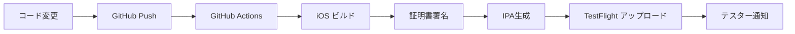

# TestFlight配信テストガイド

BottleKeepアプリのTestFlightを使った配信テストの完全ガイドです。

## 📋 概要

このガイドでは以下の手順を説明します：
1. 自動ビルド・配信の確認
2. TestFlightでのアプリ管理
3. テスターの招待と管理
4. フィードバックの収集
5. 本番リリースへの移行

## 🚀 1. 自動配信の仕組み

### 1.1 トリガー条件
以下の条件でTestFlightへの自動配信が実行されます：
- `main` ブランチへのpush
- Pull Request のマージ
- 手動でのワークフロー実行

### 1.2 配信フロー


### 1.3 ビルド番号の自動管理
- ビルド番号：GitHub Actions の実行番号を使用
- バージョン番号：`Package.swift` の設定を使用
- 例：`BottleKeep v1.0 (123)` → バージョン1.0、ビルド123

## 📱 2. TestFlightでのアプリ管理

### 2.1 App Store Connectでの確認
1. [App Store Connect](https://appstoreconnect.apple.com/) にログイン
2. 「マイApp」から「BottleKeep」を選択
3. 「TestFlight」タブを開く

### 2.2 ビルド状況の確認
各ビルドには以下の状態があります：

| 状態 | 説明 | 対応 |
|------|------|------|
| 🔄 処理中 | Apple側での処理中 | 待機（通常5-30分） |
| ⚠️ コンプライアンス待ち | 暗号化に関する質問 | 質問に回答 |
| ✅ TestFlight準備完了 | テスト配信可能 | テスターに配信 |
| 🚫 無効 | 問題が検出された | エラー確認・修正 |

### 2.3 暗号化コンプライアンス
初回アップロード時に質問されます：
1. 「暗号化を使用していますか？」→ **はい**（HTTPSを使用するため）
2. 「暗号化は標準的なものですか？」→ **はい**
3. 審査は不要として進行

## 👥 3. テスターの招待と管理

### 3.1 内部テスター（チームメンバー）
**追加手順：**
1. TestFlight → 「内部テスト」
2. 「テスターを追加」をクリック
3. App Store Connect のユーザーを選択
4. 自動的にアクセス権限が付与

**特徴：**
- 最大100人まで追加可能
- 審査不要で即座にテスト可能
- 90日間テスト可能

### 3.2 外部テスター（一般ユーザー）
**追加手順：**
1. TestFlight → 「外部テスト」
2. 新しいグループを作成（例：「ベータテスター」）
3. ビルドを選択
4. 「Beta App審査に送信」（初回のみ）
5. 承認後、テスターを招待

**特徴：**
- 最大10,000人まで追加可能
- Apple審査が必要（通常24-48時間）
- 90日間テスト可能

### 3.3 パブリックリンクの生成
```
手順：
1. 外部テストグループを選択
2. 「パブリックリンクを有効にする」
3. 生成されたリンクを共有
```

**例：**
```
https://testflight.apple.com/join/xxxxxxxx
```

## 🔄 4. 継続的な配信フロー

### 4.1 開発サイクル
```
開発 → コミット → 自動ビルド → TestFlight → フィードバック → 修正
```

### 4.2 バージョン管理戦略
- **メジャーバージョン** (1.0, 2.0)：大きな機能追加
- **マイナーバージョン** (1.1, 1.2)：新機能・改善
- **パッチバージョン** (1.0.1, 1.0.2)：バグ修正

### 4.3 ブランチ戦略
```
main ブランチ → 本番リリース候補
develop ブランチ → 開発版（オプション）
feature/* ブランチ → 新機能開発
```

## 📊 5. フィードバックの収集

### 5.1 TestFlightクラッシュレポート
1. TestFlight → 「ビルド」→ 「クラッシュ」タブ
2. クラッシュ情報の詳細分析
3. 修正後、新しいビルドで検証

### 5.2 テスターからのフィードバック
- TestFlightアプリ内でのフィードバック送信
- スクリーンショット付きレポート
- 開発者への直接メール

### 5.3 分析データ
- インストール数
- セッション数
- クラッシュ率
- デバイス・OS分布

## 🏪 6. 本番リリースへの移行

### 6.1 準備チェックリスト
- [ ] TestFlightでの十分なテスト完了
- [ ] 重要なバグの修正完了
- [ ] App Store審査ガイドラインの確認
- [ ] アプリメタデータの準備（説明文、スクリーンショット等）

### 6.2 本番ビルドの作成
```bash
# 本番用ビルドの手動作成（必要に応じて）
git tag v1.0.0
git push origin v1.0.0
```

### 6.3 App Store審査用提出
1. App Store Connect → 「App Store」タブ
2. TestFlightで検証済みのビルドを選択
3. アプリ情報・メタデータを入力
4. 「審査用に提出」

## 🔧 7. トラブルシューティング

### 7.1 よくある問題

**ビルドがTestFlightに表示されない**
```
原因：アップロードエラー
対策：GitHub Actions のログを確認
```

**テスターがアプリをインストールできない**
```
原因：デバイス登録不備
対策：開発者ポータルでUDID確認
```

**クラッシュが頻発する**
```
原因：メモリリーク、未処理例外
対策：Xcode Instruments で分析
```

### 7.2 緊急時対応

**重大なバグが発見された場合：**
1. 該当ビルドのTestFlightでの配信を停止
2. バグ修正のhotfixブランチを作成
3. 修正後、新しいビルドを配信
4. テスターに修正内容を通知

## 📈 8. 成功指標

### 8.1 品質指標
- クラッシュ率 < 1%
- テスターからの重要なフィードバック 0件
- 主要機能の動作確認 100%

### 8.2 配信指標
- ビルド成功率 > 95%
- TestFlightアップロード成功率 > 98%
- 自動化された配信時間 < 5分

## 🎯 9. ベストプラクティス

### 9.1 テスト戦略
- 複数のiOSバージョンでテスト
- 様々なデバイスサイズで確認
- ネットワーク状況を変えてテスト

### 9.2 コミュニケーション
- 新ビルドのリリースノート作成
- テスターへの定期的な進捗共有
- フィードバックへの迅速な対応

### 9.3 継続的改善
- 配信プロセスの定期的見直し
- GitHub Actions ワークフローの最適化
- テスターエクスペリエンスの向上

---

## 📞 サポート

問題が発生した場合：
1. GitHub Actions のログを確認
2. App Store Connect のステータスを確認
3. `APP_STORE_CONNECT_SETUP.md` を参照
4. Apple Developer サポートに問い合わせ

**Happy Testing! 🚀📱**