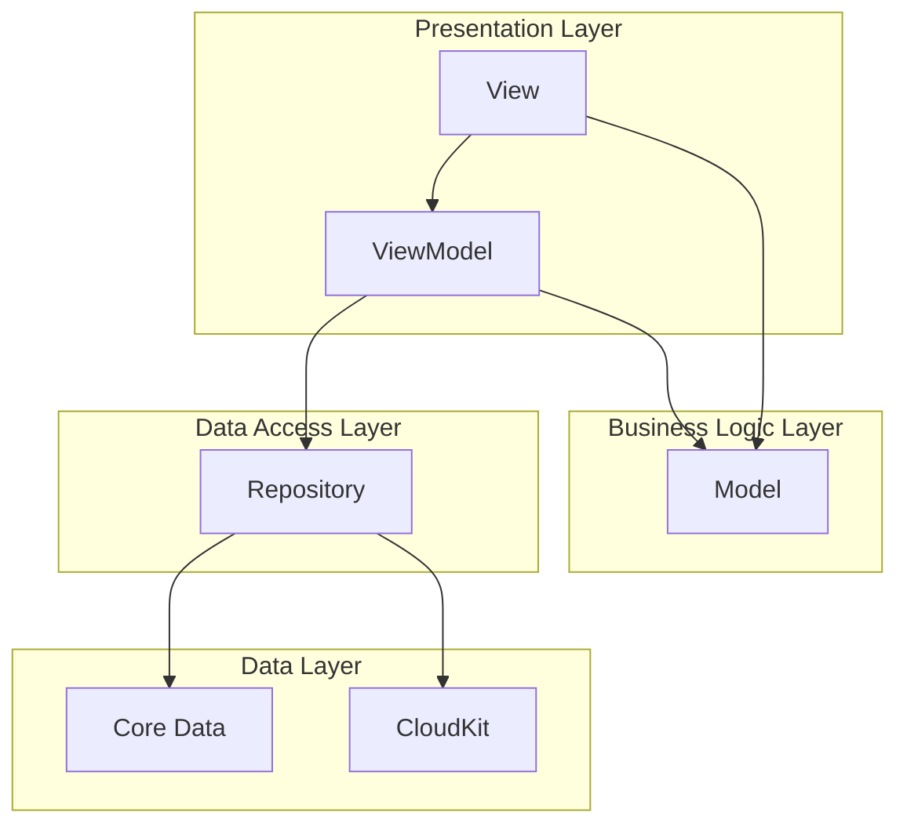
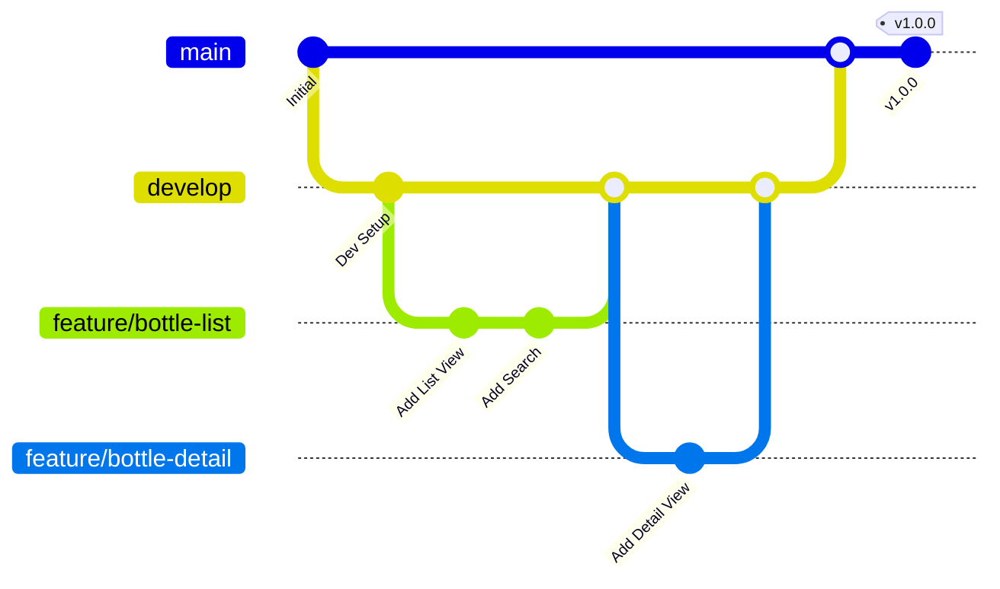

# BottleKeeper 技術スタック定義書（Enterprise Edition）

## 1. 概要

### 1.1 目的
BottleKeeperアプリの技術選択を明確にして、さくっと作って楽しく使えるアプリを作る。趣味開発なので、複雑すぎない現実的な技術を選ぶ。

**注記**: この資料は詳細版です。通常の開発では `tech-stack.md` を参照してください。
**更新要件**: 技術選択に変更があった場合、必ずこの文書と tech-stack.md の両方を更新してください。

### 1.2 技術選択の基本方針
- **シンプル重視**: 複雑な設定は避けて、すぐ作り始められる
- **Apple標準**: iOS標準のツールを使って安定性確保
- **学習コスト最小**: 新しい技術は最小限に
- **楽しさ優先**: 作るのが楽しい技術を選ぶ
- **将来考慮**: 後から改善できる余地は残す

## 2. iOS開発環境

### 2.1 開発環境要件

#### 2.1.1 必須環境
| 項目 | 要件 | 理由 |
|------|------|------|
| **macOS** | macOS 13.0+ (Ventura) | Xcode 15サポート要件 |
| **Xcode** | Xcode 15.0+ | SwiftUI最新機能、iOS 17サポート |
| **Swift** | Swift 5.9+ | async/await、actor並行性サポート |
| **iOS Deployment Target** | iOS 16.0+ | SwiftUI成熟版、Core Data CloudKit安定化 |
| **iPadOS** | iPadOS 16.0+ | SplitView、マルチタスク最適化 |

#### 2.1.2 開発マシン
今あるMacで十分。M1以降なら快適、Intelでも動く。

#### 2.1.3 サポート対象デバイス
```swift
// とりあえずiOS 16以降なら何でも
iPhone: iOS 16以降のiPhone
iPad: iPadOS 16以降のiPad
// 後で動作が重かったら制限すればいい
```

### 2.2 iOS バージョン戦略

#### 2.2.1 サポートポリシー
- **iOS 16.0+**: これで十分。大体のiPhoneで動く
- 古いバージョンは考えない（開発が複雑になるだけ）

#### 2.2.2 使う機能
```swift
// iOS 16で使える基本機能
- SwiftUI NavigationStack
- Core Data
- PhotosPicker
- 基本的なCloudKit

// 新機能は後で考える
```

## 3. UIフレームワーク選択

### 3.1 SwiftUI採用決定

#### 3.1.1 選択理由
| 理由 | 詳細 | 重要度 |
|------|------|--------|
| **開発効率** | 宣言的UI、ライブプレビュー、少ないボイラープレート | 最高 |
| **保守性** | 状態管理の簡素化、型安全性 | 高 |
| **将来性** | Apple推奨、継続的な機能拡張 | 高 |
| **iPad対応** | アダプティブレイアウトの標準サポート | 高 |
| **学習効率** | 現代的なパラダイム、豊富な学習リソース | 中 |

#### 3.1.2 UIKit vs SwiftUI 比較分析
```swift
// SwiftUI優位点
✅ 宣言的UI → 可読性・保守性向上
✅ 自動レイアウト → iPad/iPhone対応が容易
✅ 状態管理 → @State, @Binding等で直感的
✅ プレビュー → 開発効率大幅向上
✅ アニメーション → 簡潔な記述で高品質

// UIKit優位点（BottleKeeperでは重要度低）
❌ 複雑なカスタムUI → MVP要件に含まれず
❌ 細かい制御 → 過剰仕様になるリスク
❌ 古いiOS対応 → iOS 16+でカバー十分
❌ 豊富なライブラリ → 外部依存最小化方針と矛盾
```

#### 3.1.3 SwiftUIアーキテクチャ設計
```swift
// ビュー階層設計
App
├── MainTabView (TabView)
│   ├── BottleListView
│   ├── SearchView
│   └── SettingsView
├── BottleDetailView (NavigationStack)
├── BottleFormView (Sheet)
└── PhotoViewer (FullScreenCover)

// 状態管理パターン
@StateObject var bottleStore: BottleStore
@ObservedObject var searchViewModel: SearchViewModel
@State private var showingAddBottle = false
@Binding var selectedBottle: Bottle?
```

### 3.2 データバインディング戦略

#### 3.2.1 Core Data + SwiftUI統合
```swift
// NSFetchedResultsController SwiftUI統合
@FetchRequest(
    entity: Bottle.entity(),
    sortDescriptors: [
        NSSortDescriptor(keyPath: \Bottle.createdAt, ascending: false)
    ],
    predicate: NSPredicate(format: "isDeleted == FALSE")
) var bottles: FetchedResults<Bottle>

// 動的フィルタリング
@FetchRequest var bottles: FetchedResults<Bottle>

init(searchText: String) {
    let predicate = searchText.isEmpty
        ? NSPredicate(format: "isDeleted == FALSE")
        : NSPredicate(format: "isDeleted == FALSE AND name CONTAINS[cd] %@", searchText)

    _bottles = FetchRequest(
        entity: Bottle.entity(),
        sortDescriptors: [NSSortDescriptor(keyPath: \Bottle.name, ascending: true)],
        predicate: predicate
    )
}
```

## 4. データ管理技術

### 4.1 Core Data + CloudKit選択

#### 4.1.1 技術選択マトリックス
| 候補技術 | 学習コスト | iOS統合 | オフライン | 同期機能 | 総合評価 |
|---------|----------|---------|-----------|----------|----------|
| **Core Data + CloudKit** | 中 | ◎ | ◎ | ◎ | **採用** |
| SQLite + 独自同期 | 低 | ○ | ◎ | △ | 見送り |
| Realm + Atlas | 中 | ○ | ○ | ○ | 見送り |
| Firebase Firestore | 低 | △ | △ | ◎ | 見送り |

#### 4.1.2 Core Data設定詳細
```swift
// NSPersistentContainer設定
class CoreDataStack {
    static let shared = CoreDataStack()

    lazy var persistentContainer: NSPersistentCloudKitContainer = {
        let container = NSPersistentCloudKitContainer(name: "BottleKeeper")

        // CloudKit設定
        let storeDescription = container.persistentStoreDescriptions.first!
        storeDescription.setOption(true as NSNumber,
                                  forKey: NSPersistentHistoryTrackingKey)
        storeDescription.setOption(true as NSNumber,
                                  forKey: NSPersistentStoreRemoteChangeNotificationPostOptionKey)

        // セキュリティ設定
        storeDescription.setOption(FileProtectionType.complete,
                                  forKey: NSPersistentStoreFileProtectionKey)

        // パフォーマンス設定
        container.viewContext.mergePolicy = NSMergeByPropertyObjectTrumpMergePolicy
        container.viewContext.automaticallyMergesChangesFromParent = true

        return container
    }()

    var context: NSManagedObjectContext {
        return persistentContainer.viewContext
    }
}
```

#### 4.1.3 CloudKit連携戦略
```swift
// CloudKit Schema設計
Record Types:
- CD_Bottle (Core Dataマッピング)
  - Fields: name, distillery, abv, volume, remainingVolume...
  - Security: Private Database (個人データ)

- CD_Photo (Core Dataマッピング)
  - Fields: fileName, isMain, bottleReference...
  - Assets: imageFile (CKAsset)

// 同期設定
extension CoreDataStack {
    func initializeCloudKit() {
        // CloudKit利用可能性チェック
        guard CKContainer.default().accountStatus == .available else {
            print("CloudKit not available")
            return
        }

        // Schema初期化
        try? persistentContainer.initializeCloudKitSchema()
    }

    func handleRemoteChange(notification: Notification) {
        context.perform {
            // リモート変更をローカルに反映
            self.context.mergeChanges(fromContextDidSave: notification)
        }
    }
}
```

## 5. 依存関係管理

### 5.1 Swift Package Manager採用

#### 5.1.1 選択理由と代替案比較
```yaml
Swift Package Manager (採用):
  ✅ Xcode標準統合、設定簡単
  ✅ Apple公式サポート、将来性確実
  ✅ Git統合、バージョン管理透明
  ✅ ビルド時間最適化
  ✅ ライセンス管理自動化

CocoaPods (見送り理由):
  ❌ 外部ツール依存、Podfile管理負荷
  ❌ Workspace構成複雑化
  ❌ ビルド時間増加傾向

Carthage (見送り理由):
  ❌ 手動統合手順、保守負荷
  ❌ Xcode統合に制限
```

#### 5.1.2 採用予定パッケージ
```swift
// Package.swift (将来の拡張時)
dependencies: [
    // 必須依存関係なし（iOS標準フレームワーク活用）

    // 将来追加検討
    .package(url: "https://github.com/apple/swift-algorithms", from: "1.0.0"),
    .package(url: "https://github.com/apple/swift-collections", from: "1.0.0"),

    // テスト用（開発時のみ）
    .package(url: "https://github.com/Quick/Quick", from: "7.0.0"),
    .package(url: "https://github.com/Quick/Nimble", from: "12.0.0")
]
```

#### 5.1.3 外部依存最小化戦略
```swift
// iOS標準フレームワーク最大活用
import SwiftUI        // UI構築
import CoreData       // データ永続化
import CloudKit       // クラウド同期
import Combine        // 非同期処理
import PhotosUI       // 写真選択
import AVFoundation   // カメラ
import CoreImage      // 画像処理
import Network        // ネットワーク監視
import StoreKit       // アプリ内購入（将来）
import WidgetKit      // ウィジェット（将来）

// 外部ライブラリに依存しない理由:
// 1. 保守負荷削減（更新・脆弱性対応不要）
// 2. ビルド時間短縮
// 3. App Store審査リスク削減
// 4. ライセンス管理簡素化
```

## 6. アーキテクチャ設計

### 6.1 MVVM + Repository パターン採用

#### 6.1.1 アーキテクチャ図解


#### 6.1.2 各層の責務定義
```swift
// View Layer (SwiftUI Views)
struct BottleListView: View {
    @StateObject private var viewModel = BottleListViewModel()

    var body: some View {
        NavigationStack {
            List(viewModel.bottles) { bottle in
                BottleRowView(bottle: bottle)
            }
            .searchable(text: $viewModel.searchText)
            .refreshable {
                await viewModel.refresh()
            }
        }
    }
}

// ViewModel Layer (ObservableObject)
@MainActor
class BottleListViewModel: ObservableObject {
    @Published var bottles: [Bottle] = []
    @Published var searchText = ""
    @Published var isLoading = false

    private let repository: BottleRepositoryProtocol

    init(repository: BottleRepositoryProtocol = BottleRepository()) {
        self.repository = repository
    }

    func refresh() async {
        isLoading = true
        defer { isLoading = false }

        do {
            bottles = try await repository.fetchBottles(searchText: searchText)
        } catch {
            // エラーハンドリング
        }
    }
}

// Repository Layer (Data Access)
protocol BottleRepositoryProtocol {
    func fetchBottles(searchText: String) async throws -> [Bottle]
    func save(bottle: Bottle) async throws
    func delete(bottle: Bottle) async throws
}

class BottleRepository: BottleRepositoryProtocol {
    private let context: NSManagedObjectContext

    init(context: NSManagedObjectContext = CoreDataStack.shared.context) {
        self.context = context
    }

    func fetchBottles(searchText: String) async throws -> [Bottle] {
        // Core Data fetch実装
    }
}

// Model Layer (Core Data + Business Logic)
extension Bottle {
    var remainingPercentage: Double {
        guard volume > 0 else { return 0.0 }
        return Double(remainingVolume) / Double(volume) * 100.0
    }

    func updateRemainingVolume(_ newVolume: Int32) throws {
        // ビジネスルール適用
        guard newVolume >= 0 && newVolume <= volume else {
            throw BottleError.invalidRemainingVolume
        }
        remainingVolume = newVolume
        updatedAt = Date()
    }
}
```

### 6.2 依存性注入戦略

#### 6.2.1 プロトコル指向設計
```swift
// Repository抽象化
protocol BottleRepositoryProtocol: Actor {
    func fetchBottles() async throws -> [Bottle]
    func save(_ bottle: Bottle) async throws
    func delete(_ bottle: Bottle) async throws
}

protocol PhotoRepositoryProtocol: Actor {
    func savePhoto(_ image: UIImage, for bottle: Bottle) async throws -> Photo
    func deletePhoto(_ photo: Photo) async throws
}

// Service抽象化
protocol ImageProcessingServiceProtocol {
    func processImage(_ image: UIImage) async -> UIImage
    func generateThumbnail(from image: UIImage) async -> UIImage
}

protocol NotificationServiceProtocol {
    func scheduleReminder(for bottle: Bottle, when: Date) async
    func cancelReminder(for bottle: Bottle) async
}
```

#### 6.2.2 DI Container実装
```swift
// 軽量DIContainer (過剰な複雑さを避ける)
@MainActor
class DIContainer: ObservableObject {
    static let shared = DIContainer()

    // Repository
    lazy var bottleRepository: BottleRepositoryProtocol = BottleRepository()
    lazy var photoRepository: PhotoRepositoryProtocol = PhotoRepository()

    // Services
    lazy var imageService: ImageProcessingServiceProtocol = ImageProcessingService()
    lazy var notificationService: NotificationServiceProtocol = NotificationService()

    private init() {}
}

// SwiftUI Environment経由で注入
extension EnvironmentValues {
    var diContainer: DIContainer {
        get { self[DIContainerKey.self] }
        set { self[DIContainerKey.self] = newValue }
    }
}

struct DIContainerKey: EnvironmentKey {
    static let defaultValue = DIContainer.shared
}

// 使用例
struct BottleListView: View {
    @Environment(\.diContainer) var container
    @StateObject private var viewModel: BottleListViewModel

    init() {
        let container = DIContainer.shared
        _viewModel = StateObject(wrappedValue:
            BottleListViewModel(repository: container.bottleRepository)
        )
    }
}
```

### 6.3 プロジェクト構造

#### 6.3.1 フォルダ階層設計
```
BottleKeeper/
├── App/
│   ├── BottleKeeperApp.swift
│   ├── SceneDelegate.swift
│   └── AppDelegate.swift
├── Core/
│   ├── Data/
│   │   ├── CoreData/
│   │   │   ├── BottleKeeper.xcdatamodeld
│   │   │   ├── CoreDataStack.swift
│   │   │   └── Entities/
│   │   │       ├── Bottle+CoreDataClass.swift
│   │   │       └── Photo+CoreDataClass.swift
│   │   ├── Repositories/
│   │   │   ├── BottleRepository.swift
│   │   │   └── PhotoRepository.swift
│   │   └── Services/
│   │       ├── ImageProcessingService.swift
│   │       └── NotificationService.swift
│   ├── Domain/
│   │   ├── Models/
│   │   │   ├── Bottle.swift
│   │   │   └── Photo.swift
│   │   ├── UseCases/
│   │   │   ├── BottleManagementUseCase.swift
│   │   │   └── PhotoManagementUseCase.swift
│   │   └── Protocols/
│   │       ├── Repositories/
│   │       └── Services/
│   └── Common/
│       ├── Extensions/
│       ├── Utilities/
│       ├── Constants/
│       └── Errors/
├── Features/
│   ├── BottleList/
│   │   ├── Views/
│   │   │   ├── BottleListView.swift
│   │   │   └── BottleRowView.swift
│   │   └── ViewModels/
│   │       └── BottleListViewModel.swift
│   ├── BottleDetail/
│   │   ├── Views/
│   │   └── ViewModels/
│   ├── BottleForm/
│   │   ├── Views/
│   │   └── ViewModels/
│   └── Settings/
├── Resources/
│   ├── Localizable.strings
│   ├── Assets.xcassets/
│   ├── Info.plist
│   └── Entitlements/
└── Tests/
    ├── UnitTests/
    ├── IntegrationTests/
    └── UITests/
```

#### 6.3.2 命名規則とコーディング標準
```swift
// ファイル命名規則
Views:     {Feature}{Type}View.swift        // BottleListView.swift
ViewModels: {Feature}{Type}ViewModel.swift  // BottleListViewModel.swift
Models:    {Entity}.swift                   // Bottle.swift
Repositories: {Entity}Repository.swift     // BottleRepository.swift
Services:  {Purpose}Service.swift          // ImageProcessingService.swift

// Swift命名規則
Types:     PascalCase                       // BottleRepository
Variables: camelCase                        // remainingVolume
Constants: camelCase or UPPER_SNAKE_CASE    // maxBottleCount, API_BASE_URL
Protocols: PascalCase + Protocol suffix     // BottleRepositoryProtocol

// SwiftUI特有規則
@State:    private var showingAlert = false
@Binding:  @Binding var isPresented: Bool
@StateObject: @StateObject private var viewModel = ViewModel()
@ObservedObject: @ObservedObject var bottle: Bottle
```

## 7. 開発ツールとワークフロー

### 7.1 ビルドシステム

#### 7.1.1 Xcode Build Settings最適化
```swift
// Build Configuration
Debug:
  - SWIFT_OPTIMIZATION_LEVEL: -Onone (デバッグ効率)
  - SWIFT_COMPILATION_MODE: Incremental (ビルド時間短縮)
  - DEBUG_INFORMATION_FORMAT: dwarf-with-dsym
  - GCC_OPTIMIZATION_LEVEL: 0

Release:
  - SWIFT_OPTIMIZATION_LEVEL: -O (実行効率)
  - SWIFT_COMPILATION_MODE: WholeModule (最適化)
  - DEBUG_INFORMATION_FORMAT: dwarf-with-dsym
  - GCC_OPTIMIZATION_LEVEL: s (サイズ最適化)
  - DEAD_CODE_STRIPPING: YES

// Code Signing
Development:
  - CODE_SIGN_STYLE: Automatic
  - DEVELOPMENT_TEAM: {Team ID}
  - CODE_SIGN_IDENTITY: Apple Development

Distribution:
  - CODE_SIGN_STYLE: Manual
  - PROVISIONING_PROFILE_SPECIFIER: BottleKeeper Distribution
  - CODE_SIGN_IDENTITY: Apple Distribution
```

#### 7.1.2 Build Schemes設定
```yaml
Debug Scheme:
  Build Configuration: Debug
  Debugger: LLDB
  Address Sanitizer: Enabled (メモリリーク検出)
  Thread Sanitizer: Enabled (並行性問題検出)
  Environment Variables:
    - OS_ACTIVITY_MODE: disable (ログノイズ削減)

Release Scheme:
  Build Configuration: Release
  Debugger: None
  Optimizations: All Enabled
  Strip Debug Symbols: YES

Testing Scheme:
  Build Configuration: Debug
  Test Configuration: Test Plans使用
  Code Coverage: Enabled
  Environment Variables:
    - IS_TESTING: 1
```

### 7.2 テスト

#### 7.2.1 基本テストだけ
```swift
// とりあえず基本的なテストだけ書く
import XCTest
@testable import BottleKeeper

class BottleTests: XCTestCase {
    func testBottleCreation() {
        // ボトルが作れるかだけチェック
        let bottle = Bottle()
        bottle.name = "Test Bottle"
        XCTAssertEqual(bottle.name, "Test Bottle")
    }

    func testRemainingVolumeCalculation() {
        // 残量計算が正しいかだけチェック
        let bottle = Bottle()
        bottle.volume = 700
        bottle.remainingVolume = 350
        XCTAssertEqual(bottle.remainingPercentage, 50.0)
    }
}

// UIテストは後で考える（手動テストで十分）
```

#### 7.2.2 テストの考え方
趣味アプリなので：
- 基本的なロジックのテストだけ書く
- UIテストは手動で十分
- カバレッジは気にしない
- 動かなくなったらテストを追加

~~#### 7.2.2 Test Plans設定~~
趣味開発には不要。
```json
{
  "configurations": [
    {
      "name": "Unit Tests",
      "testTargets": [
        {
          "target": {
            "name": "BottleKeeperTests"
          },
          "enableCodeCoverage": true,
          "environmentVariableEntries": [
            {
              "key": "CORE_DATA_IN_MEMORY",
              "value": "1"
            }
          ]
        }
      ]
    },
    {
      "name": "UI Tests",
      "testTargets": [
        {
          "target": {
            "name": "BottleKeeperUITests"
          },
          "enableCodeCoverage": false
        }
      ]
    }
  ],
  "defaultOptions": {
    "codeCoverage": {
      "targets": [
        {
          "name": "BottleKeeper"
        }
      ]
    }
  }
}
```

### 7.3 コード品質

#### 7.3.1 シンプルに保つ
- Xcodeの基本的な警告を無視しない
- コードが読みづらくなったらリファクタリング
- SwiftLintは後で入れてもいい（無くても死なない）


### 7.4 CI/CD戦略

#### 7.4.1 GitHub Actions設定
```yaml
# .github/workflows/ios.yml
name: iOS CI/CD

on:
  push:
    branches: [ main, develop ]
  pull_request:
    branches: [ main ]

jobs:
  test:
    runs-on: macos-13
    steps:
    - uses: actions/checkout@v4

    - name: Setup Xcode
      uses: maxim-lobanov/setup-xcode@v1
      with:
        xcode-version: '15.0'

    - name: Cache SPM dependencies
      uses: actions/cache@v3
      with:
        path: .build
        key: ${{ runner.os }}-spm-${{ hashFiles('**/Package.resolved') }}

    - name: Build and Test
      run: |
        xcodebuild clean test \
          -project BottleKeeper.xcodeproj \
          -scheme BottleKeeper \
          -destination 'platform=iOS Simulator,name=iPhone 15 Pro' \
          -enableCodeCoverage YES \
          | xcpretty

    - name: Upload Coverage
      uses: codecov/codecov-action@v3
      with:
        file: ./coverage.xml

  build:
    runs-on: macos-13
    needs: test
    if: github.ref == 'refs/heads/main'
    steps:
    - uses: actions/checkout@v4

    - name: Build Archive
      run: |
        xcodebuild archive \
          -project BottleKeeper.xcodeproj \
          -scheme BottleKeeper \
          -archivePath ./BottleKeeper.xcarchive \
          -configuration Release

    - name: Export IPA
      run: |
        xcodebuild -exportArchive \
          -archivePath ./BottleKeeper.xcarchive \
          -exportPath ./export \
          -exportOptionsPlist ./ExportOptions.plist
```

#### 7.4.2 Fastlane設定
```ruby
# Fastfile
default_platform(:ios)

platform :ios do
  desc "Run tests"
  lane :test do
    run_tests(
      project: "BottleKeeper.xcodeproj",
      scheme: "BottleKeeper",
      devices: ["iPhone 15 Pro"]
    )
  end

  desc "Build for testing"
  lane :build_for_testing do
    build_app(
      project: "BottleKeeper.xcodeproj",
      scheme: "BottleKeeper",
      configuration: "Debug",
      skip_package_ipa: true
    )
  end

  desc "Deploy to TestFlight"
  lane :beta do
    increment_build_number(xcodeproj: "BottleKeeper.xcodeproj")

    build_app(
      project: "BottleKeeper.xcodeproj",
      scheme: "BottleKeeper",
      configuration: "Release"
    )

    upload_to_testflight(
      skip_waiting_for_build_processing: true
    )
  end

  desc "Deploy to App Store"
  lane :release do
    build_app(
      project: "BottleKeeper.xcodeproj",
      scheme: "BottleKeeper",
      configuration: "Release"
    )

    upload_to_app_store(
      force: true,
      submit_for_review: false
    )
  end
end
```

## 8. パフォーマンス最適化

### 8.1 メモリ管理戦略

#### 8.1.1 SwiftUI メモリ最適化
```swift
// LazyLoading実装
struct BottleListView: View {
    @FetchRequest var bottles: FetchedResults<Bottle>

    var body: some View {
        NavigationStack {
            LazyVStack(spacing: 8) {
                ForEach(bottles, id: \.id) { bottle in
                    BottleRowView(bottle: bottle)
                        .onAppear {
                            // 必要時のみデータ読み込み
                            loadBottleDetailsIfNeeded(bottle)
                        }
                }
            }
        }
    }
}

// 画像メモリ管理
class ImageCache: ObservableObject {
    private let cache = NSCache<NSString, UIImage>()
    private let maxMemoryUsage: Int = 50 * 1024 * 1024 // 50MB

    init() {
        cache.totalCostLimit = maxMemoryUsage
        cache.countLimit = 100 // 最大100枚

        // メモリ警告時のクリーンアップ
        NotificationCenter.default.addObserver(
            forName: UIApplication.didReceiveMemoryWarningNotification,
            object: nil,
            queue: .main
        ) { _ in
            self.cache.removeAllObjects()
        }
    }

    func image(for key: String) -> UIImage? {
        return cache.object(forKey: NSString(string: key))
    }

    func setImage(_ image: UIImage, forKey key: String) {
        let cost = image.jpegData(compressionQuality: 1.0)?.count ?? 0
        cache.setObject(image, forKey: NSString(string: key), cost: cost)
    }
}
```

#### 8.1.2 Core Data メモリ最適化
```swift
// Fault管理戦略
extension BottleRepository {
    func fetchBottlesOptimized(limit: Int = 50, offset: Int = 0) async throws -> [Bottle] {
        return try await context.perform {
            let request: NSFetchRequest<Bottle> = Bottle.fetchRequest()
            request.fetchLimit = limit
            request.fetchOffset = offset
            request.fetchBatchSize = 20 // メモリ効率向上
            request.returnsObjectsAsFaults = true // 必要時まで実データ読み込み遅延
            request.relationshipKeyPathsForPrefetching = [] // 関連データの事前読み込み無効

            return try self.context.fetch(request)
        }
    }

    // バックグラウンドContext使用
    func performHeavyOperation() async throws {
        let backgroundContext = CoreDataStack.shared.backgroundContext

        try await backgroundContext.perform {
            // 重い処理をバックグラウンドで実行
            let bottles = try backgroundContext.fetch(heavyRequest)

            for bottle in bottles {
                // 重い計算処理
                bottle.performComplexCalculation()
            }

            try backgroundContext.save()
        }
    }
}
```

### 8.2 画像処理最適化

#### 8.2.1 画像圧縮・リサイズ戦略
```swift
class ImageProcessor {
    static let shared = ImageProcessor()

    // マルチサイズ生成（サムネイル・標準・高解像度）
    func processBottleImage(_ originalImage: UIImage) async -> ProcessedImageSet {
        return await withTaskGroup(of: (ImageSize, UIImage?).self) { group in
            var results: [ImageSize: UIImage] = [:]

            // 並列処理で複数サイズ生成
            group.addTask {
                (.thumbnail, await self.resize(originalImage, to: CGSize(width: 150, height: 150)))
            }

            group.addTask {
                (.standard, await self.resize(originalImage, to: CGSize(width: 600, height: 600)))
            }

            group.addTask {
                (.full, await self.resize(originalImage, to: CGSize(width: 1200, height: 1200)))
            }

            for await (size, image) in group {
                if let image = image {
                    results[size] = image
                }
            }

            return ProcessedImageSet(
                thumbnail: results[.thumbnail],
                standard: results[.standard],
                full: results[.full]
            )
        }
    }

    private func resize(_ image: UIImage, to targetSize: CGSize) async -> UIImage? {
        return await Task.detached(priority: .utility) {
            guard let cgImage = image.cgImage else { return nil }

            let context = CGContext(
                data: nil,
                width: Int(targetSize.width),
                height: Int(targetSize.height),
                bitsPerComponent: cgImage.bitsPerComponent,
                bytesPerRow: 0,
                space: cgImage.colorSpace ?? CGColorSpaceCreateDeviceRGB(),
                bitmapInfo: cgImage.bitmapInfo.rawValue
            )

            context?.draw(cgImage, in: CGRect(origin: .zero, size: targetSize))

            guard let resizedCGImage = context?.makeImage() else { return nil }
            return UIImage(cgImage: resizedCGImage)
        }.value
    }

    // HEIF対応（iOS 11+、効率的な画像フォーマット）
    func compressToHEIF(_ image: UIImage, quality: CGFloat = 0.8) -> Data? {
        guard let cgImage = image.cgImage else { return nil }

        let data = NSMutableData()
        guard let destination = CGImageDestinationCreateWithData(
            data,
            "public.heif" as CFString,
            1,
            nil
        ) else { return nil }

        let options: [CFString: Any] = [
            kCGImageDestinationLossyCompressionQuality: quality
        ]

        CGImageDestinationAddImage(destination, cgImage, options as CFDictionary)
        CGImageDestinationFinalize(destination)

        return data as Data
    }
}

struct ProcessedImageSet {
    let thumbnail: UIImage?
    let standard: UIImage?
    let full: UIImage?
}

enum ImageSize {
    case thumbnail, standard, full
}
```

#### 8.2.2 AsyncImage最適化実装
```swift
// カスタムAsyncImageでキャッシュ統合
struct CachedAsyncImage<Content: View>: View {
    let url: URL?
    let cache: ImageCache
    @ViewBuilder let content: (AsyncImagePhase) -> Content

    @State private var phase: AsyncImagePhase = .empty

    var body: some View {
        content(phase)
            .task {
                await loadImage()
            }
    }

    private func loadImage() async {
        guard let url = url else {
            phase = .failure(URLError(.badURL))
            return
        }

        let cacheKey = url.absoluteString

        // キャッシュチェック
        if let cachedImage = cache.image(for: cacheKey) {
            phase = .success(cachedImage)
            return
        }

        phase = .empty

        do {
            let (data, _) = try await URLSession.shared.data(from: url)
            guard let image = UIImage(data: data) else {
                phase = .failure(URLError(.cannotParseResponse))
                return
            }

            cache.setImage(image, forKey: cacheKey)
            phase = .success(image)
        } catch {
            phase = .failure(error)
        }
    }
}
```

### 8.3 パフォーマンス指標とベンチマーク

#### 8.3.1 具体的パフォーマンス目標
```swift
// アプリ起動時間
struct LaunchTimeMetrics {
    static let targetColdStart: TimeInterval = 2.0    // 初回起動
    static let targetWarmStart: TimeInterval = 0.8    // 2回目以降
    static let targetResumeTime: TimeInterval = 0.3   // フォアグラウンド復帰

    // 測定方法
    static func measureLaunchTime() {
        let startTime = CFAbsoluteTimeGetCurrent()
        // アプリ起動完了時点で計測
        let launchTime = CFAbsoluteTimeGetCurrent() - startTime
        Logger.app.notice("Launch time: \(launchTime)s")
    }
}

// メモリ使用量目標
struct MemoryMetrics {
    static let targetAppMemory: Int = 150 * 1024 * 1024    // 150MB以下
    static let targetImageCache: Int = 50 * 1024 * 1024     // 50MB以下
    static let targetCoreDataMemory: Int = 30 * 1024 * 1024 // 30MB以下

    static func getCurrentMemoryUsage() -> Int {
        var info = mach_task_basic_info()
        var count = mach_msg_type_number_t(MemoryLayout<mach_task_basic_info>.size)/4

        let kerr: kern_return_t = withUnsafeMutablePointer(to: &info) {
            $0.withMemoryRebound(to: integer_t.self, capacity: 1) {
                task_info(mach_task_self_,
                         task_flavor_t(MACH_TASK_BASIC_INFO),
                         $0,
                         &count)
            }
        }

        if kerr == KERN_SUCCESS {
            return Int(info.resident_size)
        }
        return 0
    }
}

// UIパフォーマンス目標
struct UIPerformanceMetrics {
    static let targetFPS: Double = 60.0               // 60FPS維持
    static let targetScrollLag: TimeInterval = 0.016  // 16ms以下
    static let targetAnimationDrop: Double = 0.05     // フレームドロップ5%以下

    // FPS測定
    class FPSCounter: ObservableObject {
        @Published var currentFPS: Double = 0
        private var displayLink: CADisplayLink?
        private var lastTimestamp: CFTimeInterval = 0

        func startMonitoring() {
            displayLink = CADisplayLink(target: self, selector: #selector(updateFPS))
            displayLink?.add(to: .current, forMode: .common)
        }

        @objc private func updateFPS() {
            guard let displayLink = displayLink else { return }

            if lastTimestamp == 0 {
                lastTimestamp = displayLink.timestamp
                return
            }

            let deltaTime = displayLink.timestamp - lastTimestamp
            currentFPS = 1.0 / deltaTime
            lastTimestamp = displayLink.timestamp
        }
    }
}

// Core Dataパフォーマンス目標
struct CoreDataMetrics {
    static let targetFetchTime: TimeInterval = 0.1      // フェッチ100ms以下
    static let targetSaveTime: TimeInterval = 0.05      // 保存50ms以下
    static let targetMigrationTime: TimeInterval = 5.0  // マイグレーション5秒以下

    static func measureFetchTime<T>(_ request: NSFetchRequest<T>) async -> TimeInterval {
        let startTime = CFAbsoluteTimeGetCurrent()
        _ = try? await CoreDataStack.shared.context.perform {
            try CoreDataStack.shared.context.fetch(request)
        }
        return CFAbsoluteTimeGetCurrent() - startTime
    }
}
```

#### 8.3.2 ベンチマークテスト実装
```swift
// パフォーマンステストスイート
class PerformanceBenchmarks: XCTestCase {
    func testAppLaunchTime() {
        measure(metrics: [XCTClockMetric()]) {
            // アプリ起動シミュレーション
            let expectation = XCTestExpectation(description: "App Launch")

            DispatchQueue.main.async {
                // メインビュー読み込みシミュレーション
                let _ = BottleListView()
                expectation.fulfill()
            }

            wait(for: [expectation], timeout: LaunchTimeMetrics.targetColdStart)
        }
    }

    func testBottleListScrollPerformance() {
        let bottles = generateTestBottles(count: 1000)

        measure(metrics: [XCTClockMetric(), XCTMemoryMetric()]) {
            let viewModel = BottleListViewModel()
            viewModel.bottles = bottles

            // スクロールシミュレーション
            for i in 0..<100 {
                let _ = viewModel.bottles[i * 10]
            }
        }
    }

    func testImageLoadingPerformance() {
        let testImages = generateTestImages(count: 50, size: CGSize(width: 1024, height: 1024))

        measure(metrics: [XCTClockMetric(), XCTMemoryMetric()]) {
            let cache = ImageCache()

            for (index, image) in testImages.enumerated() {
                cache.setImage(image, forKey: "test_\(index)")
            }
        }
    }

    func testCoreDataBulkOperations() {
        let context = CoreDataStack.shared.testContext

        measure(metrics: [XCTClockMetric()]) {
            // 1000件のバルク挿入
            for i in 0..<1000 {
                let bottle = Bottle(context: context)
                bottle.name = "Test Bottle \(i)"
                bottle.distillery = "Test Distillery"
                bottle.volume = 700
                bottle.remainingVolume = 700
                bottle.abv = 40.0
            }

            try! context.save()
        }
    }
}
```

### 8.4 SwiftUI パフォーマンス最適化

#### 8.3.1 View更新最適化
```swift
// 過剰な再描画防止
struct BottleRowView: View {
    let bottle: Bottle

    var body: some View {
        HStack {
            // 画像部分を分離してキャッシュ効果向上
            BottleImageView(photoPath: bottle.mainPhotoPath)
                .frame(width: 60, height: 60)

            VStack(alignment: .leading) {
                Text(bottle.name)
                    .font(.headline)

                Text(bottle.distillery)
                    .font(.subheadline)
                    .foregroundColor(.secondary)

                // 残量表示を分離（状態変化時のみ更新）
                RemainigVolumeView(
                    volume: bottle.volume,
                    remainingVolume: bottle.remainingVolume
                )
            }

            Spacer()
        }
        .contentShape(Rectangle()) // タップ範囲最適化
    }
}

// 計算コストの高いViewを分離
struct RemainigVolumeView: View {
    let volume: Int32
    let remainingVolume: Int32

    // 計算結果をキャッシュ
    private var percentage: Double {
        guard volume > 0 else { return 0.0 }
        return Double(remainingVolume) / Double(volume)
    }

    var body: some View {
        HStack {
            ProgressView(value: percentage)
                .progressViewStyle(LinearProgressViewStyle())
                .frame(width: 100)

            Text("\(Int(percentage * 100))%")
                .font(.caption)
                .monospacedDigit() // 数字の幅統一
        }
    }
}

// @State最適化
struct BottleDetailView: View {
    @State private var showingEditSheet = false
    @State private var showingDeleteAlert = false

    // 重い処理は@StateObject分離
    @StateObject private var imageLoader = ImageLoader()

    let bottle: Bottle

    var body: some View {
        ScrollView {
            LazyVStack {
                // 画像表示は遅延ロード
                PhotoCarouselView(bottle: bottle)
                    .environmentObject(imageLoader)

                // 詳細情報
                BottleInfoView(bottle: bottle)
            }
        }
        .toolbar {
            ToolbarItem(placement: .primaryAction) {
                Button("Edit") {
                    showingEditSheet = true
                }
            }
        }
        .sheet(isPresented: $showingEditSheet) {
            BottleEditView(bottle: bottle)
        }
    }
}
```

#### 8.3.2 Animation最適化
```swift
// 高性能アニメーション実装
struct BottleListView: View {
    @State private var bottles: [Bottle] = []
    @State private var searchText = ""

    var body: some View {
        NavigationStack {
            LazyVStack {
                ForEach(filteredBottles) { bottle in
                    BottleRowView(bottle: bottle)
                        .transition(.asymmetric(
                            insertion: .move(edge: .trailing).combined(with: .opacity),
                            removal: .move(edge: .leading).combined(with: .opacity)
                        ))
                }
            }
            .animation(.spring(response: 0.6, dampingFraction: 0.8), value: filteredBottles)
        }
        .searchable(text: $searchText)
    }

    private var filteredBottles: [Bottle] {
        if searchText.isEmpty {
            return bottles
        } else {
            return bottles.filter { bottle in
                bottle.name.localizedCaseInsensitiveContains(searchText) ||
                bottle.distillery.localizedCaseInsensitiveContains(searchText)
            }
        }
    }
}

// GPU最適化のためのDrawingGroup活用
struct ChartView: View {
    let dataPoints: [DataPoint]

    var body: some View {
        Canvas { context, size in
            // Core Graphics直接描画でパフォーマンス向上
            drawChart(context: context, size: size, data: dataPoints)
        }
        .drawingGroup() // GPU描画最適化
    }

    private func drawChart(context: GraphicsContext, size: CGSize, data: [DataPoint]) {
        // 高性能チャート描画実装
    }
}
```

## 9. セキュリティ・プライバシー

### 9.1 データ暗号化戦略

#### 9.1.1 iOS暗号化フレームワーク活用
```swift
import CryptoKit
import Security

// アプリデータ暗号化
class SecureDataManager {
    private let keychain = Keychain(service: "com.yourcompany.BottleKeeper")

    // マスターキー生成・管理
    private func generateMasterKey() throws -> SymmetricKey {
        let key = SymmetricKey(size: .bits256)
        let keyData = key.withUnsafeBytes { Data($0) }

        // Keychainに安全に保存
        try keychain.set(keyData, key: "master_encryption_key")
        return key
    }

    private func getMasterKey() throws -> SymmetricKey {
        guard let keyData = try keychain.getData("master_encryption_key") else {
            return try generateMasterKey()
        }
        return SymmetricKey(data: keyData)
    }

    // 機密データ暗号化
    func encryptSensitiveData(_ data: Data) throws -> Data {
        let key = try getMasterKey()
        let sealedBox = try AES.GCM.seal(data, using: key)
        return sealedBox.combined!
    }

    func decryptSensitiveData(_ encryptedData: Data) throws -> Data {
        let key = try getMasterKey()
        let sealedBox = try AES.GCM.SealedBox(combined: encryptedData)
        return try AES.GCM.open(sealedBox, using: key)
    }
}

// Keychain設定
struct Keychain {
    private let service: String

    init(service: String) {
        self.service = service
    }

    func set(_ data: Data, key: String) throws {
        let query: [String: Any] = [
            kSecClass as String: kSecClassGenericPassword,
            kSecAttrService as String: service,
            kSecAttrAccount as String: key,
            kSecValueData as String: data,
            kSecAttrAccessible as String: kSecAttrAccessibleWhenUnlockedThisDeviceOnly
        ]

        let status = SecItemAdd(query as CFDictionary, nil)

        if status == errSecDuplicateItem {
            // 既存アイテム更新
            let updateQuery: [String: Any] = [
                kSecClass as String: kSecClassGenericPassword,
                kSecAttrService as String: service,
                kSecAttrAccount as String: key
            ]

            let updateAttributes: [String: Any] = [
                kSecValueData as String: data
            ]

            let updateStatus = SecItemUpdate(updateQuery as CFDictionary, updateAttributes as CFDictionary)
            guard updateStatus == errSecSuccess else {
                throw KeychainError.updateFailed(updateStatus)
            }
        } else {
            guard status == errSecSuccess else {
                throw KeychainError.saveFailed(status)
            }
        }
    }

    func getData(_ key: String) throws -> Data? {
        let query: [String: Any] = [
            kSecClass as String: kSecClassGenericPassword,
            kSecAttrService as String: service,
            kSecAttrAccount as String: key,
            kSecReturnData as String: true,
            kSecMatchLimit as String: kSecMatchLimitOne
        ]

        var result: CFTypeRef?
        let status = SecItemCopyMatching(query as CFDictionary, &result)

        guard status == errSecSuccess else {
            if status == errSecItemNotFound {
                return nil
            }
            throw KeychainError.loadFailed(status)
        }

        return result as? Data
    }
}

enum KeychainError: Error {
    case saveFailed(OSStatus)
    case loadFailed(OSStatus)
    case updateFailed(OSStatus)
}
```

#### 9.1.2 App Transport Security設定
```xml
<!-- Info.plist -->
<key>NSAppTransportSecurity</key>
<dict>
    <key>NSAllowsArbitraryLoads</key>
    <false/>
    <key>NSAllowsArbitraryLoadsInWebContent</key>
    <false/>
    <key>NSAllowsLocalNetworking</key>
    <false/>
    <key>NSExceptionDomains</key>
    <dict>
        <!-- 将来のAPI連携時のみ追加 -->
    </dict>
</dict>

<!-- プライバシー権限 -->
<key>NSCameraUsageDescription</key>
<string>ボトルの写真を撮影するためにカメラへのアクセスが必要です</string>
<key>NSPhotoLibraryUsageDescription</key>
<string>ボトルの写真を選択するためにフォトライブラリへのアクセスが必要です</string>
```

### 9.2 生体認証統合

#### 9.2.1 Face ID / Touch ID実装
```swift
import LocalAuthentication

class BiometricAuthManager: ObservableObject {
    @Published var isAuthenticated = false
    @Published var authenticationError: AuthenticationError?

    private let context = LAContext()

    enum AuthenticationError: Error, LocalizedError {
        case biometryNotAvailable
        case biometryNotEnrolled
        case authenticationFailed
        case userCancel
        case systemCancel

        var errorDescription: String? {
            switch self {
            case .biometryNotAvailable:
                return "生体認証が利用できません"
            case .biometryNotEnrolled:
                return "生体認証が設定されていません"
            case .authenticationFailed:
                return "認証に失敗しました"
            case .userCancel:
                return "認証がキャンセルされました"
            case .systemCancel:
                return "システムによって認証がキャンセルされました"
            }
        }
    }

    var biometryType: LABiometryType {
        context.biometryType
    }

    var isBiometricAvailable: Bool {
        var error: NSError?
        return context.canEvaluatePolicy(.deviceOwnerAuthenticationWithBiometrics, error: &error)
    }

    func authenticate() async {
        guard isBiometricAvailable else {
            await MainActor.run {
                self.authenticationError = .biometryNotAvailable
            }
            return
        }

        let reason = "BottleKeeperのデータにアクセスするために認証が必要です"

        do {
            let success = try await context.evaluatePolicy(
                .deviceOwnerAuthenticationWithBiometrics,
                localizedReason: reason
            )

            await MainActor.run {
                self.isAuthenticated = success
                self.authenticationError = nil
            }
        } catch let error as LAError {
            await MainActor.run {
                self.isAuthenticated = false
                self.authenticationError = mapLAError(error)
            }
        } catch {
            await MainActor.run {
                self.isAuthenticated = false
                self.authenticationError = .authenticationFailed
            }
        }
    }

    private func mapLAError(_ error: LAError) -> AuthenticationError {
        switch error.code {
        case .biometryNotAvailable:
            return .biometryNotAvailable
        case .biometryNotEnrolled:
            return .biometryNotEnrolled
        case .userCancel:
            return .userCancel
        case .systemCancel:
            return .systemCancel
        default:
            return .authenticationFailed
        }
    }
}

// SwiftUI統合
struct AuthenticationView: View {
    @StateObject private var authManager = BiometricAuthManager()

    var body: some View {
        VStack {
            if authManager.isAuthenticated {
                MainTabView()
            } else {
                VStack(spacing: 20) {
                    Image(systemName: authManager.biometryType == .faceID ? "faceid" : "touchid")
                        .font(.system(size: 50))
                        .foregroundColor(.blue)

                    Text("BottleKeeper")
                        .font(.largeTitle)
                        .fontWeight(.bold)

                    Text("アプリのロックを解除してください")
                        .font(.body)
                        .multilineTextAlignment(.center)

                    Button("認証") {
                        Task {
                            await authManager.authenticate()
                        }
                    }
                    .buttonStyle(.borderedProminent)

                    if let error = authManager.authenticationError {
                        Text(error.localizedDescription)
                            .foregroundColor(.red)
                            .font(.caption)
                    }
                }
                .padding()
            }
        }
        .onAppear {
            // アプリ起動時に自動認証
            Task {
                await authManager.authenticate()
            }
        }
        .onReceive(NotificationCenter.default.publisher(for: UIApplication.willEnterForegroundNotification)) { _ in
            // フォアグラウンド復帰時に再認証
            authManager.isAuthenticated = false
        }
    }
}
```

## 10. 配布・運用戦略

### 10.1 App Store配布準備

#### 10.1.1 App Store Connect設定
```yaml
App Information:
  Name: BottleKeeper
  Bundle ID: com.yourcompany.bottlekeep
  SKU: bottlekeep-ios-2024
  Primary Language: Japanese

App Privacy:
  Data Collection: None (個人データ収集なし)
  Data Usage: Internal Use Only
  Data Sharing: None

App Store Optimization:
  Keywords: ウイスキー,コレクション,管理,在庫,テイスティング
  Description: 個人のウイスキーコレクション管理に特化したアプリ
  Screenshots: iPhone/iPad最適化済み

Age Rating: 17+ (アルコール関連コンテンツ)

Categories:
  Primary: Lifestyle
  Secondary: Food & Drink
```

#### 10.1.2 証明書・プロビジョニング管理
```bash
# 開発証明書
Development Certificate:
  - Apple Development Certificate
  - Development Provisioning Profile
  - Automatic Signing推奨

# 配布証明書
Distribution Certificate:
  - Apple Distribution Certificate
  - App Store Distribution Provisioning Profile
  - Manual Signing必須

# 証明書更新スケジュール
Development: 1年ごと更新 (自動通知設定)
Distribution: 1年ごと更新 (3ヶ月前に準備開始)
```

### 10.2 TestFlight配布戦略

#### 10.2.1 ベータテスト計画
```swift
// ベータ版機能制限
#if DEBUG || TESTFLIGHT
extension FeatureFlags {
    static let enableAdvancedFeatures = true
    static let enableDebugLogging = true
    static let enableBetaFeedback = true
}
#else
extension FeatureFlags {
    static let enableAdvancedFeatures = false
    static let enableDebugLogging = false
    static let enableBetaFeedback = false
}
#endif

// TestFlight専用フィードバック
struct BetaFeedbackView: View {
    @State private var feedbackText = ""
    @State private var showingAlert = false

    var body: some View {
        NavigationStack {
            VStack {
                Text("ベータ版フィードバック")
                    .font(.title2)
                    .fontWeight(.semibold)

                TextEditor(text: $feedbackText)
                    .border(Color.gray, width: 1)
                    .frame(minHeight: 100)

                Button("フィードバック送信") {
                    sendFeedback()
                }
                .buttonStyle(.borderedProminent)
                .disabled(feedbackText.isEmpty)
            }
            .padding()
        }
    }

    private func sendFeedback() {
        // TestFlightフィードバック送信実装
        let feedbackData = BetaFeedback(
            text: feedbackText,
            appVersion: Bundle.main.appVersion,
            buildNumber: Bundle.main.buildNumber,
            deviceModel: UIDevice.current.model,
            osVersion: UIDevice.current.systemVersion
        )

        BetaFeedbackService.shared.send(feedbackData)
        showingAlert = true
    }
}
```

#### 10.2.2 クラッシュレポート・Analytics
```swift
import OSLog

// 構造化ログ実装
extension Logger {
    static let app = Logger(subsystem: "com.yourcompany.BottleKeeper", category: "app")
    static let coreData = Logger(subsystem: "com.yourcompany.BottleKeeper", category: "coredata")
    static let cloudKit = Logger(subsystem: "com.yourcompany.BottleKeeper", category: "cloudkit")
    static let ui = Logger(subsystem: "com.yourcompany.BottleKeeper", category: "ui")
}

// クラッシュレポート強化
class CrashReporter {
    static let shared = CrashReporter()

    func recordBreadcrumb(_ message: String, category: String = "general") {
        Logger.app.info("Breadcrumb: \(category) - \(message)")
    }

    func recordError(_ error: Error, context: String) {
        Logger.app.error("Error in \(context): \(error.localizedDescription)")

        // 本番環境では匿名化された情報のみ記録
        let errorInfo = [
            "context": context,
            "error_type": String(describing: type(of: error)),
            "app_version": Bundle.main.appVersion,
            "os_version": UIDevice.current.systemVersion
        ]

        // 将来的にFirebase Crashlyticsやデバイス内ログ記録
    }

    func recordPerformanceMetric(_ metric: String, value: Double, unit: String) {
        Logger.app.notice("Performance: \(metric) = \(value) \(unit)")
    }
}

// 使用例
extension BottleRepository {
    func save(_ bottle: Bottle) async throws {
        CrashReporter.shared.recordBreadcrumb("Starting bottle save operation")

        let startTime = CFAbsoluteTimeGetCurrent()

        do {
            try await context.perform {
                try self.context.save()
            }

            let duration = CFAbsoluteTimeGetCurrent() - startTime
            CrashReporter.shared.recordPerformanceMetric("bottle_save_duration", value: duration, unit: "seconds")

        } catch {
            CrashReporter.shared.recordError(error, context: "BottleRepository.save")
            throw error
        }
    }
}
```

## 11. コスト分析と予算管理

### 11.1 開発コスト

#### 11.1.1 初期費用
```yaml
必須費用:
  Apple Developer Program: $99/年
    - iOSアプリ開発ライセンス
    - App Store配布権
    - TestFlightベータテスト
    - CloudKit基本利用

任意費用:
  開発マシン: $1,500-3,000
    - MacBook Air M2 (16GB RAM): $1,499
    - MacBook Pro M2 Pro (32GB RAM): $2,499
    - 外部ディスプレイ: $300-800

  ツールライセンス:
    - GitHub Pro: $4/月 (プライベートリポジトリ)
    - Fastlane: 無料
    - SwiftLint/SwiftFormat: 無料
```

#### 11.1.2 運用コスト
```yaml
CloudKit使用料（個人アプリ）:
  無料枠:
    - パブリックデータベース: 1GB
    - プライベートデータベース: 1GB/ユーザー
    - データ転送: 1GB/月
    - リクエスト: 1M/月

  追加料金（無料枠超過時）:
    - ストレージ: $0.03/GB/月
    - データ転送: $0.10/GB
    - リクエスト: $1.00/1Mリクエスト

App Store手数料:
  アプリ堆売上: Apple 30%手数料
  サブスクリプション: 2年目以降 15%
  小規模事業者プログラム: 年間$100万以下は15%
```

#### 11.1.3 予算計画
```swift
struct DevelopmentBudget {
    static let yearlyFixedCosts: Int = 99         // Apple Developer Program
    static let monthlyVariableCosts: Int = 4      // GitHub Pro

    static var totalYearlyCost: Int {
        return yearlyFixedCosts + (monthlyVariableCosts * 12)
    }

    // CloudKit使用料予測
    static func estimateCloudKitCost(users: Int, averageDataPerUser: Double) -> Double {
        let totalData = Double(users) * averageDataPerUser // GB
        let freeAllowance = Double(users) * 1.0 // 1GB/ユーザー
        let paidData = max(0, totalData - freeAllowance)

        return paidData * 0.03 // $0.03/GB/月
    }
}

// 使用例
let monthlyCloudKitCost = DevelopmentBudget.estimateCloudKitCost(
    users: 100,
    averageDataPerUser: 0.5 // 500MB/ユーザー
)
// 結果: $0 (無料枠内)
```

### 11.2 Gitワークフローとバージョン管理

#### 11.2.1 ブランチ戦略


#### 11.2.2 コミット規則
```bash
# Conventional Commits 準拠
<type>(<scope>): <description>

# タイプ
feat:     新機能
fix:      バグ修正
docs:     ドキュメント
style:    コードスタイル変更
refactor: リファクタリング
test:     テスト追加
chore:    ビルド・ツール変更

# 例
feat(bottle): add remaining volume visualization
fix(core-data): resolve bottle save concurrency issue
docs(readme): update installation instructions
test(bottle-list): add search functionality tests
```

#### 11.2.3 リリース管理
```yaml
バージョンスキーム: Semantic Versioning (SemVer)
  メジャー: 非互換の変更 (2.0.0)
  マイナー: 後方互換の機能追加 (1.1.0)
  パッチ: バグ修正 (1.0.1)

タグ付け規則:
  - v1.0.0: MVPリリース
  - v1.1.0: CloudKit同期機能
  - v1.2.0: 統計機能
  - v2.0.0: メジャーアーキテクチャ変更

リリースフロー:
  1. feature/* ブランチで開発
  2. develop ブランチにマージ
  3. 統合テスト実施
  4. main ブランチにマージ
  5. タグ付け、App Storeリリース
```

### 11.3 監視・運用戦略

#### 11.3.1 APM (アプリケーションパフォーマンス監視)
```swift
// カスタムメトリクス収集
class MetricsCollector {
    static let shared = MetricsCollector()
    private let logger = Logger.app

    func recordAppLaunch(time: TimeInterval, isFirstLaunch: Bool) {
        logger.notice("App launched in \(time)s, first launch: \(isFirstLaunch)")

        // メトリクスサーバーに送信 (将来実装)
        if time > LaunchTimeMetrics.targetColdStart {
            recordPerformanceIssue("Slow app launch: \(time)s")
        }
    }

    func recordUserAction(_ action: String, screen: String) {
        logger.info("User action: \(action) on \(screen)")
    }

    func recordError(_ error: Error, context: String) {
        logger.error("Error in \(context): \(error.localizedDescription)")

        // クリティカルエラーのアラート
        if isCriticalError(error) {
            sendCriticalErrorAlert(error, context: context)
        }
    }

    private func recordPerformanceIssue(_ issue: String) {
        // パフォーマンス問題の記録とアラート
        logger.warning("Performance issue: \(issue)")
    }

    private func isCriticalError(_ error: Error) -> Bool {
        // クリティカルエラーの判定ロジック
        return error is CoreDataError || error is KeychainError
    }
}

// パフォーマンスダッシュボード
struct PerformanceDashboard {
    let appLaunchTimes: [TimeInterval]
    let memoryUsageHistory: [Int]
    let crashCount: Int
    let userSatisfactionScore: Double

    var isHealthy: Bool {
        let avgLaunchTime = appLaunchTimes.reduce(0, +) / Double(appLaunchTimes.count)
        let avgMemoryUsage = memoryUsageHistory.reduce(0, +) / memoryUsageHistory.count

        return avgLaunchTime < LaunchTimeMetrics.targetColdStart &&
               avgMemoryUsage < MemoryMetrics.targetAppMemory &&
               crashCount == 0 &&
               userSatisfactionScore > 4.0
    }
}
```

#### 11.3.2 アラート設定
```swift
// アラート管理システム
class AlertManager {
    enum AlertLevel {
        case info, warning, critical
    }

    struct Alert {
        let level: AlertLevel
        let message: String
        let timestamp: Date
        let context: [String: Any]
    }

    static let shared = AlertManager()

    func sendAlert(_ alert: Alert) {
        switch alert.level {
        case .info:
            Logger.app.info("\(alert.message)")
        case .warning:
            Logger.app.warning("\(alert.message)")
            // 将来: Slack通知等
        case .critical:
            Logger.app.critical("\(alert.message)")
            // 将来: 緊急通知 (SMS, Email)
        }
    }

    // 主要アラートシナリオ
    func checkAppHealth() {
        let memoryUsage = MemoryMetrics.getCurrentMemoryUsage()

        if memoryUsage > MemoryMetrics.targetAppMemory {
            sendAlert(Alert(
                level: .warning,
                message: "High memory usage: \(memoryUsage / 1024 / 1024)MB",
                timestamp: Date(),
                context: ["memory_usage": memoryUsage]
            ))
        }

        if memoryUsage > MemoryMetrics.targetAppMemory * 2 {
            sendAlert(Alert(
                level: .critical,
                message: "Critical memory usage: \(memoryUsage / 1024 / 1024)MB",
                timestamp: Date(),
                context: ["memory_usage": memoryUsage]
            ))
        }
    }
}
```

### 11.4 学習リソースとスキルアップ戦略

#### 11.4.1 技術学習パス
```yaml
SwiftUIマスターパス (4-6週間):
  Week 1-2: 基礎
    - Apple公式チュートリアル
    - "SwiftUI Essentials" (Apple Developer)
    - シンプルなビュー作成

  Week 3-4: 中級
    - ナビゲーション、ステート管理
    - "Data Flow Through SwiftUI" (WWDC)
    - 実際のアプリプロジェクト

  Week 5-6: 上級
    - パフォーマンス最適化
    - カスタムコンポーネント
    - Core Data統合

Core Dataマスターパス (3-4週間):
  Week 1: 基礎
    - "Core Data Fundamentals" (Apple)
    - エンティティ、モデル設計

  Week 2: 中級
    - フェッチ、プレディケート
    - リレーションシップ管理

  Week 3-4: 上級
    - CloudKit統合
    - パフォーマンス最適化
    - マイグレーション

CloudKitマスターパス (2-3週間):
  Week 1: 基礎
    - "CloudKit Fundamentals" (Apple)
    - スキーマ設計

  Week 2-3: 実装
    - Core Data + CloudKit
    - 競合解決
    - テスト戦略
```

#### 11.4.2 継続学習システム
```swift
// 技術キャッチアップシステム
struct TechLearningPlan {
    static let weeklyCommitment: TimeInterval = 5 * 3600 // 5時間/週

    static let learningResources = [
        "WWDCセッション": "https://developer.apple.com/videos/",
        "Appleドキュメント": "https://developer.apple.com/documentation/",
        "Swift.org": "https://swift.org/documentation/",
        "iOS Dev Weekly": "https://iosdevweekly.com/",
        "Point-Free": "https://www.pointfree.co/"
    ]

    static let practiceProjects = [
        "Level 1": ["Calculator", "To-Do List", "Weather App"],
        "Level 2": ["Core Data Note App", "Photo Gallery", "Network Client"],
        "Level 3": ["CloudKit Sync App", "Widget Extension", "Watch App"]
    ]
}

// スキル評価システム
enum SkillLevel {
    case beginner, intermediate, advanced, expert
}

struct TechnicalSkills {
    var swiftUI: SkillLevel = .beginner
    var coreData: SkillLevel = .beginner
    var cloudKit: SkillLevel = .beginner
    var testing: SkillLevel = .beginner
    var debugging: SkillLevel = .beginner
    var performance: SkillLevel = .beginner

    func getWeakestSkills() -> [String] {
        let mirror = Mirror(reflecting: self)
        return mirror.children.compactMap { child in
            if let skill = child.value as? SkillLevel, skill == .beginner {
                return child.label
            }
            return nil
        }
    }
}
```

## 12. トラブルシューティングガイド

### 12.1 よくある問題と解決方法

#### 12.1.1 Core Data関連問題
```swift
// Core Data問題診断
class CoreDataDiagnostics {
    static func diagnosePersistentStoreError(_ error: Error) -> String {
        if let nsError = error as NSError? {
            switch nsError.code {
            case NSPersistentStoreIncompatibleVersionHashError:
                return "データモデルバージョン不整合。マイグレーションが必要です。"
            case NSMigrationMissingSourceModelError:
                return "マイグレーション元モデルが見つかりません。"
            case NSPersistentStoreOperationError:
                return "永続ストア操作エラー。ディスク容量とアクセス権限を確認してください。"
            case NSValidationMissingMandatoryPropertyError:
                return "必須プロパティが不足しています。データ検証を確認してください。"
            default:
                return "Core Dataエラー: \(nsError.localizedDescription)"
            }
        }
        return "不明なCore Dataエラー"
    }

    static func performHealthCheck() -> CoreDataHealthReport {
        let context = CoreDataStack.shared.context

        var report = CoreDataHealthReport()

        // ストアファイル存在確認
        if let storeURL = CoreDataStack.shared.persistentContainer.persistentStoreCoordinator.persistentStores.first?.url {
            report.storeFileExists = FileManager.default.fileExists(atPath: storeURL.path)

            // ファイルサイズ確認
            if let attributes = try? FileManager.default.attributesOfItem(atPath: storeURL.path),
               let fileSize = attributes[.size] as? Int64 {
                report.storeFileSize = fileSize
                report.isFileSizeNormal = fileSize < 100 * 1024 * 1024 // 100MB以下
            }
        }

        // オブジェクト数確認
        do {
            let bottleCount = try context.count(for: Bottle.fetchRequest())
            report.entityCounts["Bottle"] = bottleCount
            report.isEntityCountNormal = bottleCount < 10000 // 10,000本以下
        } catch {
            report.errors.append("エンティティ数取得エラー: \(error.localizedDescription)")
        }

        return report
    }
}

struct CoreDataHealthReport {
    var storeFileExists = false
    var storeFileSize: Int64 = 0
    var isFileSizeNormal = true
    var entityCounts: [String: Int] = [:]
    var isEntityCountNormal = true
    var errors: [String] = []

    var isHealthy: Bool {
        return storeFileExists && isFileSizeNormal && isEntityCountNormal && errors.isEmpty
    }
}
```

#### 12.1.2 CloudKit同期問題
```swift
// CloudKit問題診断
class CloudKitDiagnostics {
    static func diagnoseAccountStatus() async -> String {
        let container = CKContainer.default()

        do {
            let status = try await container.accountStatus()
            switch status {
            case .available:
                return "CloudKitアカウント正常"
            case .noAccount:
                return "iCloudアカウントが設定されていません。設定 > [ユーザー名] > iCloudを確認してください。"
            case .restricted:
                return "iCloudアクセスが制限されています。設定 > スクリーンタイム > コンテンツとプライバシーの制限を確認してください。"
            case .couldNotDetermine:
                return "iCloudアカウント状態を確認できません。ネットワーク接続を確認してください。"
            case .temporarilyUnavailable:
                return "iCloudサービスが一時的に利用できません。しばらく待ってから再試行してください。"
            @unknown default:
                return "不明なiCloudアカウント状態"
            }
        } catch {
            return "iCloudアカウント確認エラー: \(error.localizedDescription)"
        }
    }

    static func checkCloudKitPermission() async -> String {
        let container = CKContainer.default()

        do {
            let permission = try await container.applicationPermission(for: .userDiscoverability)
            switch permission {
            case .granted:
                return "CloudKit権限正常"
            case .denied:
                return "CloudKit権限が拒否されています。設定 > プライバシーとセキュリティ > CloudKitを確認してください。"
            case .couldNotComplete:
                return "CloudKit権限確認が完了できません。ネットワーク接続を確認してください。"
            case .initialState:
                return "CloudKit権限が初期状態です。アプリでiCloud使用の許可が必要です。"
            @unknown default:
                return "不明なCloudKit権限状態"
            }
        } catch {
            return "CloudKit権限確認エラー: \(error.localizedDescription)"
        }
    }
}
```

#### 12.1.3 パフォーマンス問題診断
```swift
// パフォーマンス診断
class PerformanceDiagnostics {
    static func diagnoseMemoryUsage() -> MemoryDiagnosticReport {
        let memoryUsage = MemoryMetrics.getCurrentMemoryUsage()
        let targetMemory = MemoryMetrics.targetAppMemory

        var report = MemoryDiagnosticReport()
        report.currentUsage = memoryUsage
        report.targetUsage = targetMemory
        report.usagePercentage = Double(memoryUsage) / Double(targetMemory) * 100

        if memoryUsage > targetMemory * 2 {
            report.severity = .critical
            report.recommendations = [
                "アプリを再起動してください",
                "不要な写真データを削除してください",
                "バックグラウンドアプリを終了してください"
            ]
        } else if memoryUsage > targetMemory {
            report.severity = .warning
            report.recommendations = [
                "古い写真データのキャッシュをクリアしてください",
                "大量の画像表示を避けてください"
            ]
        } else {
            report.severity = .normal
        }

        return report
    }

    static func diagnoseLaunchTime() -> LaunchTimeDiagnostic {
        let lastLaunchTime = UserDefaults.standard.double(forKey: "LastLaunchTime")
        let targetLaunchTime = LaunchTimeMetrics.targetColdStart

        var diagnostic = LaunchTimeDiagnostic()
        diagnostic.lastLaunchTime = lastLaunchTime
        diagnostic.targetLaunchTime = targetLaunchTime

        if lastLaunchTime > targetLaunchTime * 2 {
            diagnostic.recommendations = [
                "デバイスを再起動してください",
                "アプリデータをリセットしてください",
                "不要なアプリを削除してメモリを解放してください"
            ]
        } else if lastLaunchTime > targetLaunchTime {
            diagnostic.recommendations = [
                "バックグラウンドアプリを終了してください",
                "デバイスのストレージ容量を確認してください"
            ]
        }

        return diagnostic
    }
}

struct MemoryDiagnosticReport {
    var currentUsage: Int = 0
    var targetUsage: Int = 0
    var usagePercentage: Double = 0
    var severity: DiagnosticSeverity = .normal
    var recommendations: [String] = []
}

struct LaunchTimeDiagnostic {
    var lastLaunchTime: TimeInterval = 0
    var targetLaunchTime: TimeInterval = 0
    var recommendations: [String] = []
}

enum DiagnosticSeverity {
    case normal, warning, critical
}
```

### 12.2 デバッグ手順

#### 12.2.1 ステップバイステップデバッグ
```swift
// デバッグ支援ツール
class DebugHelper {
    static var isDebugModeEnabled: Bool {
        #if DEBUG
        return true
        #else
        return UserDefaults.standard.bool(forKey: "DebugModeEnabled")
        #endif
    }

    static func enableDebugLogging() {
        UserDefaults.standard.set(true, forKey: "DebugModeEnabled")
        Logger.app.notice("Debug logging enabled")
    }

    static func logCoreDataOperations() {
        if isDebugModeEnabled {
            // Core Data SQL出力有効化
            let arguments = ProcessInfo.processInfo.arguments
            if !arguments.contains("-com.apple.CoreData.SQLDebug") {
                Logger.coreData.info("To enable SQL debugging, add '-com.apple.CoreData.SQLDebug 1' to launch arguments")
            }
        }
    }

    static func dumpEntityStats() {
        guard isDebugModeEnabled else { return }

        let context = CoreDataStack.shared.context

        do {
            let bottleCount = try context.count(for: Bottle.fetchRequest())
            let photoCount = try context.count(for: Photo.fetchRequest())

            Logger.coreData.debug("Entity counts - Bottles: \(bottleCount), Photos: \(photoCount)")
        } catch {
            Logger.coreData.error("Failed to count entities: \(error)")
        }
    }
}

// デバッグメニュー（開発時のみ）
struct DebugMenuView: View {
    @State private var showingDiagnostics = false
    @State private var diagnosticReport: String = ""

    var body: some View {
        NavigationStack {
            List {
                Section("診断") {
                    Button("Core Data診断") {
                        runCoreDatDiagnostics()
                    }

                    Button("CloudKit診断") {
                        Task {
                            await runCloudKitDiagnostics()
                        }
                    }

                    Button("パフォーマンス診断") {
                        runPerformanceDiagnostics()
                    }
                }

                Section("デバッグ操作") {
                    Button("テストデータ生成") {
                        generateTestData()
                    }

                    Button("キャッシュクリア") {
                        clearCaches()
                    }

                    Button("ログ出力") {
                        DebugHelper.dumpEntityStats()
                    }
                }
            }
            .navigationTitle("デバッグメニュー")
        }
        .sheet(isPresented: $showingDiagnostics) {
            NavigationStack {
                ScrollView {
                    Text(diagnosticReport)
                        .font(.monospaced(.caption)())
                        .padding()
                }
                .navigationTitle("診断結果")
                .navigationBarTitleDisplayMode(.inline)
                .toolbar {
                    ToolbarItem(placement: .navigationBarTrailing) {
                        Button("閉じる") {
                            showingDiagnostics = false
                        }
                    }
                }
            }
        }
    }

    private func runCoreDatDiagnostics() {
        let report = CoreDataDiagnostics.performHealthCheck()
        diagnosticReport = formatHealthReport(report)
        showingDiagnostics = true
    }

    private func runCloudKitDiagnostics() async {
        let accountStatus = await CloudKitDiagnostics.diagnoseAccountStatus()
        let permission = await CloudKitDiagnostics.checkCloudKitPermission()

        diagnosticReport = "iCloudアカウント: \(accountStatus)\n\nCloudKit権限: \(permission)"
        showingDiagnostics = true
    }

    private func runPerformanceDiagnostics() {
        let memoryReport = PerformanceDiagnostics.diagnoseMemoryUsage()
        let launchReport = PerformanceDiagnostics.diagnoseLaunchTime()

        diagnosticReport = formatPerformanceReport(memoryReport, launchReport)
        showingDiagnostics = true
    }
}
```

## 13. 国際化・アクセシビリティ

### 13.1 国際化戦略

#### 13.1.1 多言語対応計画
```swift
// 対応言語リスト
struct SupportedLanguages {
    static let primary = "ja" // 日本語（プライマリ）
    static let secondary = ["en"] // 英語（セカンダリ）
    static let future = ["ko", "zh-Hans", "zh-Hant"] // 将来対応予定

    static var current: String {
        return Locale.current.language.languageCode?.identifier ?? primary
    }

    static var isRTL: Bool {
        return Locale.characterDirection(forLanguage: current) == .rightToLeft
    }
}

// 文字列リソース管理
enum LocalizedStrings {
    // ボトル関連
    static let bottleName = NSLocalizedString("bottle.name", comment: "ボトル名")
    static let distillery = NSLocalizedString("bottle.distillery", comment: "蒸留所")
    static let remainingVolume = NSLocalizedString("bottle.remaining_volume", comment: "残量")

    // アクション
    static let add = NSLocalizedString("action.add", comment: "追加")
    static let edit = NSLocalizedString("action.edit", comment: "編集")
    static let delete = NSLocalizedString("action.delete", comment: "削除")
    static let save = NSLocalizedString("action.save", comment: "保存")
    static let cancel = NSLocalizedString("action.cancel", comment: "キャンセル")

    // エラーメッセージ
    static let errorGeneral = NSLocalizedString("error.general", comment: "エラーが発生しました")
    static let errorNetwork = NSLocalizedString("error.network", comment: "ネットワークエラー")
    static let errorSave = NSLocalizedString("error.save", comment: "保存に失敗しました")

    // アクセシビリティ
    static let accessibilityBottleImage = NSLocalizedString("accessibility.bottle_image", comment: "ボトルの写真")
    static let accessibilityRemainingPercentage = NSLocalizedString("accessibility.remaining_percentage", comment: "残量パーセンテージ")
}

// 地域固有フォーマット
class RegionalFormatter {
    static let shared = RegionalFormatter()

    lazy var volumeFormatter: MeasurementFormatter = {
        let formatter = MeasurementFormatter()
        formatter.unitOptions = .providedUnit
        formatter.unitStyle = .medium
        return formatter
    }()

    lazy var percentageFormatter: NumberFormatter = {
        let formatter = NumberFormatter()
        formatter.numberStyle = .percent
        formatter.minimumFractionDigits = 0
        formatter.maximumFractionDigits = 1
        return formatter
    }()

    lazy var priceFormatter: NumberFormatter = {
        let formatter = NumberFormatter()
        formatter.numberStyle = .currency
        formatter.locale = Locale.current
        return formatter
    }()

    func formatVolume(_ volume: Int32) -> String {
        let measurement = Measurement(value: Double(volume), unit: UnitVolume.milliliters)
        return volumeFormatter.string(from: measurement)
    }

    func formatPercentage(_ value: Double) -> String {
        return percentageFormatter.string(from: NSNumber(value: value / 100)) ?? "\(Int(value))%"
    }

    func formatPrice(_ price: Decimal) -> String {
        return priceFormatter.string(from: price as NSDecimalNumber) ?? ""
    }
}
```

#### 13.1.2 RTL対応
```swift
// RTL（右から左）言語対応
struct RTLSupportView<Content: View>: View {
    let content: Content

    init(@ViewBuilder content: () -> Content) {
        self.content = content()
    }

    var body: some View {
        content
            .environment(\.layoutDirection, SupportedLanguages.isRTL ? .rightToLeft : .leftToRight)
            .flipsForRightToLeftLayoutDirection(SupportedLanguages.isRTL)
    }
}

// RTL対応のカスタムビュー
struct BottleRowView: View {
    let bottle: Bottle

    var body: some View {
        HStack {
            AsyncImage(url: bottle.mainPhotoURL) { image in
                image
                    .resizable()
                    .aspectRatio(contentMode: .fill)
            } placeholder: {
                Rectangle()
                    .fill(Color.gray.opacity(0.3))
            }
            .frame(width: 60, height: 60)
            .clipShape(RoundedRectangle(cornerRadius: 8))

            VStack(alignment: .leading, spacing: 4) {
                Text(bottle.name)
                    .font(.headline)
                    .lineLimit(1)

                Text(bottle.distillery)
                    .font(.subheadline)
                    .foregroundColor(.secondary)
                    .lineLimit(1)

                HStack {
                    ProgressView(value: bottle.remainingPercentage / 100)
                        .progressViewStyle(LinearProgressViewStyle())

                    Text(RegionalFormatter.shared.formatPercentage(bottle.remainingPercentage))
                        .font(.caption)
                        .monospacedDigit()
                }
            }

            Spacer()
        }
        .environment(\.layoutDirection, SupportedLanguages.isRTL ? .rightToLeft : .leftToRight)
    }
}
```

### 13.2 アクセシビリティ実装

#### 13.2.1 VoiceOver対応
```swift
// VoiceOver最適化
struct AccessibleBottleRowView: View {
    let bottle: Bottle

    var body: some View {
        HStack {
            AsyncImage(url: bottle.mainPhotoURL) { image in
                image
                    .resizable()
                    .aspectRatio(contentMode: .fill)
            } placeholder: {
                Image(systemName: "photo")
                    .foregroundColor(.gray)
            }
            .frame(width: 60, height: 60)
            .clipShape(RoundedRectangle(cornerRadius: 8))
            .accessibilityLabel(LocalizedStrings.accessibilityBottleImage)
            .accessibilityValue(bottle.name)

            VStack(alignment: .leading, spacing: 4) {
                Text(bottle.name)
                    .font(.headline)
                    .accessibilityAddTraits(.isHeader)

                Text(bottle.distillery)
                    .font(.subheadline)
                    .foregroundColor(.secondary)

                HStack {
                    ProgressView(value: bottle.remainingPercentage / 100)
                        .progressViewStyle(LinearProgressViewStyle())
                        .accessibilityLabel(LocalizedStrings.accessibilityRemainingPercentage)
                        .accessibilityValue("\(Int(bottle.remainingPercentage))パーセント")

                    Text(RegionalFormatter.shared.formatPercentage(bottle.remainingPercentage))
                        .font(.caption)
                        .accessibilityHidden(true) // プログレスバーで読み上げるため重複を避ける
                }
            }

            Spacer()
        }
        .accessibilityElement(children: .combine)
        .accessibilityLabel("\(bottle.name)、\(bottle.distillery)")
        .accessibilityValue("残量\(Int(bottle.remainingPercentage))パーセント")
        .accessibilityAddTraits(.isButton)
        .accessibilityHint("タップして詳細を表示")
    }
}

// アクセシビリティ設定
struct AccessibilitySettings {
    static var isVoiceOverRunning: Bool {
        UIAccessibility.isVoiceOverRunning
    }

    static var isSwitchControlRunning: Bool {
        UIAccessibility.isSwitchControlRunning
    }

    static var preferredContentSizeCategory: ContentSizeCategory {
        ContentSizeCategory(UIApplication.shared.preferredContentSizeCategory)
    }

    static var isDynamicTypeEnabled: Bool {
        preferredContentSizeCategory.isAccessibilityCategory
    }
}

// Dynamic Type対応
struct DynamicTypeView<Content: View>: View {
    let content: Content
    @Environment(\.sizeCategory) var sizeCategory

    init(@ViewBuilder content: () -> Content) {
        self.content = content()
    }

    var body: some View {
        content
            .dynamicTypeSize(...DynamicTypeSize.accessibility3) // 最大サイズ制限
    }
}

// アクセシブルなカスタムビューコンポーネント
struct AccessibleProgressView: View {
    let value: Double
    let label: String

    var body: some View {
        VStack(alignment: .leading) {
            HStack {
                Text(label)
                    .font(.caption)

                Spacer()

                Text("\(Int(value * 100))%")
                    .font(.caption)
                    .monospacedDigit()
            }

            ProgressView(value: value)
                .progressViewStyle(LinearProgressViewStyle())
        }
        .accessibilityElement(children: .combine)
        .accessibilityLabel(label)
        .accessibilityValue("\(Int(value * 100))パーセント")
        .accessibilityAddTraits(.updatesFrequently)
    }
}
```

#### 13.2.2 アクセシビリティテスト
```swift
// アクセシビリティテストスイート
class AccessibilityTests: XCTestCase {
    var app: XCUIApplication!

    override func setUpWithError() throws {
        app = XCUIApplication()
        app.launchEnvironment["UIAccessibilityIsVoiceOverRunning"] = "1"
        app.launch()
    }

    func testVoiceOverBottleList() {
        let bottleList = app.tables["bottle_list"]
        XCTAssertTrue(bottleList.exists)

        let firstBottle = bottleList.cells.firstMatch
        XCTAssertTrue(firstBottle.exists)

        // VoiceOverラベルの確認
        let accessibilityLabel = firstBottle.label
        XCTAssertFalse(accessibilityLabel.isEmpty)
        XCTAssertTrue(accessibilityLabel.contains("残量"))
    }

    func testDynamicTypeSupport() {
        // 大きなフォントサイズでのテスト
        app.launchEnvironment["ContentSizeCategory"] = "UICTContentSizeCategoryAccessibilityExtraExtraExtraLarge"
        app.launch()

        let bottleNameLabel = app.staticTexts["bottle_name"]
        XCTAssertTrue(bottleNameLabel.exists)

        // テキストが切り取られていないことを確認
        XCTAssertFalse(bottleNameLabel.label.hasSuffix("..."))
    }

    func testSwitchControlNavigation() {
        app.launchEnvironment["UIAccessibilityIsSwitchControlRunning"] = "1"
        app.launch()

        // Switch Controlでのナビゲーションテスト
        let addButton = app.buttons["add_bottle"]
        XCTAssertTrue(addButton.exists)
        XCTAssertTrue(addButton.isHittable)

        addButton.tap()

        let saveButton = app.buttons["save_bottle"]
        XCTAssertTrue(saveButton.exists)
        XCTAssertTrue(saveButton.isHittable)
    }
}
```

## 14. 環境管理・設定分離戦略

### 14.1 環境構成管理

#### 14.1.1 環境別設定
```swift
// 環境定義
enum AppEnvironment {
    case development
    case staging
    case production

    static var current: AppEnvironment {
        #if DEBUG
        return .development
        #elseif STAGING
        return .staging
        #else
        return .production
        #endif
    }

    var cloudKitContainerIdentifier: String {
        switch self {
        case .development:
            return "iCloud.com.yourcompany.BottleKeeper.dev"
        case .staging:
            return "iCloud.com.yourcompany.BottleKeeper.staging"
        case .production:
            return "iCloud.com.yourcompany.BottleKeeper"
        }
    }

    var bundleIdentifier: String {
        switch self {
        case .development:
            return "com.yourcompany.BottleKeeper.dev"
        case .staging:
            return "com.yourcompany.BottleKeeper.staging"
        case .production:
            return "com.yourcompany.BottleKeeper"
        }
    }

    var appName: String {
        switch self {
        case .development:
            return "BottleKeeper Dev"
        case .staging:
            return "BottleKeeper Staging"
        case .production:
            return "BottleKeeper"
        }
    }

    var isLoggingEnabled: Bool {
        switch self {
        case .development, .staging:
            return true
        case .production:
            return false
        }
    }
}

// 設定管理
struct AppConfig {
    static let environment = AppEnvironment.current

    struct CoreData {
        static let modelName = "BottleKeeper"
        static let enableCloudKit = true
        static let enablePersistentHistoryTracking = true

        static var storeURL: URL {
            let documentsPath = FileManager.default.urls(for: .documentDirectory, in: .userDomainMask).first!
            switch environment {
            case .development:
                return documentsPath.appendingPathComponent("BottleKeeper_dev.sqlite")
            case .staging:
                return documentsPath.appendingPathComponent("BottleKeeper_staging.sqlite")
            case .production:
                return documentsPath.appendingPathComponent("BottleKeeper.sqlite")
            }
        }
    }

    struct Performance {
        static let imageCacheSize: Int = environment == .development ? 10 * 1024 * 1024 : 50 * 1024 * 1024
        static let batchSize: Int = environment == .development ? 10 : 20
        static let prefetchLimit: Int = environment == .development ? 50 : 100
    }

    struct Security {
        static let requireBiometricAuth: Bool = environment == .production
        static let enableDataEncryption: Bool = environment != .development
        static let keychain服务名称: String = "\(environment.bundleIdentifier).keychain"
    }
}

// 設定ファイル管理
class ConfigurationManager {
    static let shared = ConfigurationManager()

    private var config: [String: Any] = [:]

    init() {
        loadConfiguration()
    }

    private func loadConfiguration() {
        // plist設定ファイル読み込み
        let configFileName: String
        switch AppEnvironment.current {
        case .development:
            configFileName = "Config-Development"
        case .staging:
            configFileName = "Config-Staging"
        case .production:
            configFileName = "Config-Production"
        }

        guard let path = Bundle.main.path(forResource: configFileName, ofType: "plist"),
              let configData = NSDictionary(contentsOfFile: path) as? [String: Any] else {
            Logger.app.error("Failed to load configuration file: \(configFileName)")
            return
        }

        config = configData
    }

    func getString(_ key: String, defaultValue: String = "") -> String {
        return config[key] as? String ?? defaultValue
    }

    func getInt(_ key: String, defaultValue: Int = 0) -> Int {
        return config[key] as? Int ?? defaultValue
    }

    func getBool(_ key: String, defaultValue: Bool = false) -> Bool {
        return config[key] as? Bool ?? defaultValue
    }
}
```

#### 14.1.2 Build Configuration
```swift
// Build Settings設定
/*
Development Build Settings:
- SWIFT_ACTIVE_COMPILATION_CONDITIONS = DEBUG DEVELOPMENT
- GCC_PREPROCESSOR_DEFINITIONS = DEBUG=1 DEVELOPMENT=1
- PRODUCT_BUNDLE_IDENTIFIER = com.yourcompany.BottleKeeper.dev
- PRODUCT_NAME = BottleKeeper Dev

Staging Build Settings:
- SWIFT_ACTIVE_COMPILATION_CONDITIONS = STAGING
- GCC_PREPROCESSOR_DEFINITIONS = STAGING=1
- PRODUCT_BUNDLE_IDENTIFIER = com.yourcompany.BottleKeeper.staging
- PRODUCT_NAME = BottleKeeper Staging

Production Build Settings:
- SWIFT_ACTIVE_COMPILATION_CONDITIONS = PRODUCTION
- GCC_PREPROCESSOR_DEFINITIONS = PRODUCTION=1
- PRODUCT_BUNDLE_IDENTIFIER = com.yourcompany.BottleKeeper
- PRODUCT_NAME = BottleKeeper
*/

// Info.plist環境別設定
/*
Info-Development.plist:
```xml
<key>CFBundleDisplayName</key>
<string>BottleKeeper Dev</string>
<key>CloudKitContainerIdentifier</key>
<string>iCloud.com.yourcompany.BottleKeeper.dev</string>
<key>EnableTestingFeatures</key>
<true/>
```

Info-Production.plist:
```xml
<key>CFBundleDisplayName</key>
<string>BottleKeeper</string>
<key>CloudKitContainerIdentifier</key>
<string>iCloud.com.yourcompany.BottleKeeper</string>
<key>EnableTestingFeatures</key>
<false/>
```
*/

// 環境検出ユーティリティ
struct EnvironmentDetector {
    static var isRunningInSimulator: Bool {
        #if targetEnvironment(simulator)
        return true
        #else
        return false
        #endif
    }

    static var isRunningTests: Bool {
        return ProcessInfo.processInfo.environment["XCTestConfigurationFilePath"] != nil
    }

    static var isRunningUITests: Bool {
        return ProcessInfo.processInfo.arguments.contains("IS_UI_TESTING")
    }

    static var buildConfiguration: String {
        #if DEBUG
        return "Debug"
        #else
        return "Release"
        #endif
    }
}
```

### 14.2 依存関係脆弱性管理

#### 14.2.1 依存関係監査
```swift
// 依存関係セキュリティ監査
struct DependencySecurityAudit {
    struct Package {
        let name: String
        let version: String
        let source: String
        let lastSecurityScan: Date
        let knownVulnerabilities: [Vulnerability]
    }

    struct Vulnerability {
        let id: String
        let severity: Severity
        let description: String
        let fixedInVersion: String?

        enum Severity {
            case low, medium, high, critical
        }
    }

    static let approvedPackages: [Package] = [
        // 現在は外部依存関係なし
        // 将来追加時の監査対象
    ]

    static func performSecurityAudit() -> SecurityAuditReport {
        var report = SecurityAuditReport()

        // Package.resolvedファイルから依存関係を読み込み
        guard let packageResolvedPath = Bundle.main.path(forResource: "Package", ofType: "resolved") else {
            report.status = .noDependencies
            return report
        }

        // 依存関係の脆弱性チェック
        for package in approvedPackages {
            let vulnerabilityCount = package.knownVulnerabilities.count
            let criticalVulnerabilities = package.knownVulnerabilities.filter { $0.severity == .critical }

            if !criticalVulnerabilities.isEmpty {
                report.criticalIssues.append("\(package.name): \(criticalVulnerabilities.count) critical vulnerabilities")
            }

            if vulnerabilityCount > 0 {
                report.totalVulnerabilities += vulnerabilityCount
            }
        }

        report.status = report.criticalIssues.isEmpty ? .safe : .vulnerable
        return report
    }
}

struct SecurityAuditReport {
    var status: SecurityStatus = .unknown
    var totalVulnerabilities: Int = 0
    var criticalIssues: [String] = []
    var lastAuditDate: Date = Date()

    enum SecurityStatus {
        case safe, vulnerable, noDependencies, unknown
    }

    var isSecure: Bool {
        return status == .safe || status == .noDependencies
    }
}

// 自動セキュリティチェック
class AutomatedSecurityChecker {
    static func setupPeriodicChecks() {
        // 週次セキュリティチェック
        Timer.scheduledTimer(withTimeInterval: 7 * 24 * 3600, repeats: true) { _ in
            Task {
                let report = DependencySecurityAudit.performSecurityAudit()
                if !report.isSecure {
                    await sendSecurityAlert(report)
                }
            }
        }
    }

    private static func sendSecurityAlert(_ report: SecurityAuditReport) async {
        Logger.app.critical("Security vulnerability detected: \(report.criticalIssues.joined(separator: ", "))")

        // 将来: 開発者への緊急通知
        // await NotificationService.sendCriticalAlert(
        //     "Security Alert",
        //     "Critical vulnerabilities found in dependencies"
        // )
    }
}
```

#### 14.2.2 ライセンス管理
```swift
// オープンソースライセンス管理
struct LicenseManager {
    struct LicenseInfo {
        let packageName: String
        let version: String
        let licenseType: LicenseType
        let licenseText: String
        let requiresAttribution: Bool
        let isCommercialUseAllowed: Bool
    }

    enum LicenseType {
        case mit, apache2, bsd3, gpl3, lgpl, proprietary, unknown

        var isApprovedForCommercialUse: Bool {
            switch self {
            case .mit, .apache2, .bsd3:
                return true
            case .gpl3, .lgpl:
                return false // 要注意
            case .proprietary, .unknown:
                return false
            }
        }
    }

    static let currentLicenses: [LicenseInfo] = [
        // 現在は外部依存関係なし
        // 将来追加時のライセンス管理
    ]

    static func generateAttributionText() -> String {
        let attributions = currentLicenses
            .filter { $0.requiresAttribution }
            .map { "\($0.packageName) \($0.version) - \($0.licenseType)" }

        if attributions.isEmpty {
            return "このアプリは外部ライブラリを使用していません。"
        }

        return "このアプリは以下のオープンソースライブラリを使用しています:\n\n" +
               attributions.joined(separator: "\n")
    }

    static func validateLicenseCompliance() -> LicenseComplianceReport {
        var report = LicenseComplianceReport()

        for license in currentLicenses {
            if !license.isCommercialUseAllowed {
                report.issues.append("Commercial use restriction: \(license.packageName)")
            }

            if license.licenseType == .unknown {
                report.issues.append("Unknown license: \(license.packageName)")
            }
        }

        report.isCompliant = report.issues.isEmpty
        return report
    }
}

struct LicenseComplianceReport {
    var isCompliant: Bool = true
    var issues: [String] = []
    var recommendedActions: [String] = []
}
```

## 15. 将来技術ロードマップ

### 11.1 短期技術拡張 (3-6ヶ月)

#### 11.1.1 CloudKit同期実装
```swift
// CloudKit統合アーキテクチャ
class CloudKitSyncManager: ObservableObject {
    @Published var syncStatus: SyncStatus = .idle
    @Published var lastSyncDate: Date?

    private let container = CKContainer.default()
    private let database: CKDatabase

    init() {
        database = container.privateCloudDatabase
    }

    func enableSync() async throws {
        // CloudKit利用可能性チェック
        let accountStatus = try await container.accountStatus()
        guard accountStatus == .available else {
            throw CloudKitError.accountNotAvailable
        }

        // Core DataでCloudKit有効化
        let description = CoreDataStack.shared.persistentContainer.persistentStoreDescriptions.first!
        description.setOption(true as NSNumber, forKey: NSPersistentCloudKitContainerOptionsKey)

        syncStatus = .syncing

        do {
            try await performInitialSync()
            syncStatus = .completed
            lastSyncDate = Date()
        } catch {
            syncStatus = .failed(error)
            throw error
        }
    }

    private func performInitialSync() async throws {
        // 初回同期ロジック
        let localBottles = try await fetchLocalBottles()
        let remoteBottles = try await fetchRemoteBottles()

        // 競合解決とマージ
        try await resolveConflicts(local: localBottles, remote: remoteBottles)
    }
}

enum SyncStatus {
    case idle
    case syncing
    case completed
    case failed(Error)
}
```

#### 11.1.2 ウィジェット実装
```swift
import WidgetKit
import SwiftUI

// BottleKeeperウィジェット
struct BottleKeeperWidget: Widget {
    let kind: String = "BottleKeeperWidget"

    var body: some WidgetConfiguration {
        StaticConfiguration(kind: kind, provider: BottleProvider()) { entry in
            BottleWidgetEntryView(entry: entry)
        }
        .configurationDisplayName("BottleKeeper")
        .description("お気に入りボトルの残量を確認")
        .supportedFamilies([.systemSmall, .systemMedium])
    }
}

struct BottleProvider: TimelineProvider {
    func placeholder(in context: Context) -> BottleEntry {
        BottleEntry(date: Date(), bottle: placeholderBottle)
    }

    func getSnapshot(in context: Context, completion: @escaping (BottleEntry) -> ()) {
        let entry = BottleEntry(date: Date(), bottle: favoriteBottle)
        completion(entry)
    }

    func getTimeline(in context: Context, completion: @escaping (Timeline<BottleEntry>) -> ()) {
        var entries: [BottleEntry] = []

        // 1時間ごとの更新タイムライン
        let currentDate = Date()
        for hourOffset in 0 ..< 24 {
            let entryDate = Calendar.current.date(byAdding: .hour, value: hourOffset, to: currentDate)!
            let entry = BottleEntry(date: entryDate, bottle: getFavoriteBottle())
            entries.append(entry)
        }

        let timeline = Timeline(entries: entries, policy: .atEnd)
        completion(timeline)
    }
}

struct BottleWidgetEntryView : View {
    var entry: BottleProvider.Entry

    var body: some View {
        VStack {
            Text(entry.bottle.name)
                .font(.headline)

            ProgressView(value: entry.bottle.remainingPercentage / 100)
                .progressViewStyle(LinearProgressViewStyle())

            Text("\(Int(entry.bottle.remainingPercentage))% 残")
                .font(.caption)
        }
        .padding()
    }
}
```

### 11.2 中期技術拡張 (6-12ヶ月)

#### 11.2.1 Apple Watch対応
```swift
import WatchKit
import SwiftUI

// Apple Watch アプリ
struct BottleKeeperWatchApp: App {
    var body: some Scene {
        WindowGroup {
            ContentView()
        }
    }
}

struct WatchBottleListView: View {
    @State private var bottles: [Bottle] = []

    var body: some View {
        NavigationStack {
            List(bottles) { bottle in
                WatchBottleRowView(bottle: bottle)
            }
            .navigationTitle("BottleKeeper")
        }
        .onAppear {
            loadBottles()
        }
    }
}

struct WatchBottleRowView: View {
    let bottle: Bottle

    var body: some View {
        VStack(alignment: .leading) {
            Text(bottle.name)
                .font(.headline)
                .lineLimit(1)

            HStack {
                ProgressView(value: bottle.remainingPercentage / 100)
                    .progressViewStyle(LinearProgressViewStyle())

                Text("\(Int(bottle.remainingPercentage))%")
                    .font(.caption)
            }
        }
    }
}

// Watch Connectivity実装
import WatchConnectivity

class WatchConnectivityManager: NSObject, ObservableObject, WCSessionDelegate {
    static let shared = WatchConnectivityManager()

    override init() {
        super.init()
        if WCSession.isSupported() {
            WCSession.default.delegate = self
            WCSession.default.activate()
        }
    }

    func sendBottleData(_ bottles: [Bottle]) {
        guard WCSession.default.isReachable else { return }

        let bottleData = bottles.map { bottle in
            [
                "id": bottle.id.uuidString,
                "name": bottle.name,
                "remainingPercentage": bottle.remainingPercentage
            ]
        }

        WCSession.default.sendMessage(["bottles": bottleData], replyHandler: nil)
    }

    // WCSessionDelegate実装
    func session(_ session: WCSession, activationDidCompleteWith activationState: WCSessionActivationState, error: Error?) {
        // アクティベーション完了処理
    }

    func sessionDidBecomeInactive(_ session: WCSession) {
        // セッション非アクティブ処理
    }

    func sessionDidDeactivate(_ session: WCSession) {
        // セッション無効化処理
    }
}
```

#### 11.2.2 Shortcuts対応
```swift
import Intents
import IntentsUI

// Siri Shortcuts定義
class BottleRemainingIntent: INIntent {
    // "Hey Siri, 山崎の残量を教えて"
}

class BottleRemainingIntentHandler: NSObject, BottleRemainingIntentHandling {
    func handle(intent: BottleRemainingIntent, completion: @escaping (BottleRemainingIntentResponse) -> Void) {
        // ボトル検索・残量回答実装
        let response = BottleRemainingIntentResponse(code: .success, userActivity: nil)
        response.spokenResponse = "山崎は75%残っています"
        completion(response)
    }
}

// Shortcuts App統合
struct ShortcutsIntegration {
    static func donateQuickActions() {
        // 在庫確認のショートカット
        let activity = NSUserActivity(activityType: "com.yourcompany.BottleKeeper.checkStock")
        activity.title = "在庫確認"
        activity.isEligibleForSearch = true
        activity.isEligibleForPrediction = true

        let attributes = CSSearchableItemAttributeSet(itemContentType: "com.yourcompany.BottleKeeper.action")
        attributes.contentDescription = "ボトルの在庫状況を確認"
        activity.contentAttributeSet = attributes

        activity.becomeCurrent()
    }
}
```

### 11.3 長期技術拡張 (12ヶ月以降)

#### 11.3.1 AR機能実装
```swift
import ARKit
import RealityKit

// ARボトル認識
struct ARBottleScanner: UIViewRepresentable {
    @Binding var recognizedBottle: Bottle?

    func makeUIView(context: Context) -> ARView {
        let arView = ARView(frame: .zero)

        // Object Detection設定
        let config = ARWorldTrackingConfiguration()
        config.detectionObjects = loadBottleReferenceObjects()
        arView.session.run(config)

        // AR Anchor追跡
        arView.scene.subscribe(to: SceneEvents.AnchoredStateChanged.self) { event in
            if let objectAnchor = event.anchor as? ARObjectAnchor {
                handleBottleDetection(objectAnchor)
            }
        }

        return arView
    }

    func updateUIView(_ uiView: ARView, context: Context) {
        // 更新処理
    }

    private func loadBottleReferenceObjects() -> Set<ARReferenceObject> {
        // 3Dスキャンしたボトルの参照オブジェクト読み込み
        guard let referenceObjects = ARReferenceObject.referenceObjects(
            inGroupNamed: "BottleObjects",
            bundle: nil
        ) else { return [] }

        return referenceObjects
    }

    private func handleBottleDetection(_ anchor: ARObjectAnchor) {
        // ボトル認識時の処理
        let bottleName = anchor.referenceObject.name ?? "Unknown"
        recognizedBottle = findBottle(byName: bottleName)
    }
}
```

#### 11.3.2 機械学習統合
```swift
import CreateML
import CoreML

// テイスティングノート解析
class TastingNoteAnalyzer {
    private var model: MLModel?

    init() {
        loadModel()
    }

    private func loadModel() {
        guard let modelURL = Bundle.main.url(forResource: "TastingNoteClassifier", withExtension: "mlmodelc"),
              let model = try? MLModel(contentsOf: modelURL) else {
            return
        }

        self.model = model
    }

    func analyzeTastingNote(_ note: String) async -> TastingProfile? {
        guard let model = model else { return nil }

        // テキスト解析による風味プロファイル抽出
        let input = TastingNoteClassifierInput(text: note)

        do {
            let prediction = try model.prediction(from: input)
            return TastingProfile(
                sweetness: prediction.sweetness,
                smokiness: prediction.smokiness,
                fruitiness: prediction.fruitiness,
                spiciness: prediction.spiciness
            )
        } catch {
            return nil
        }
    }
}

struct TastingProfile {
    let sweetness: Double
    let smokiness: Double
    let fruitiness: Double
    let spiciness: Double
}

// レコメンデーションエンジン
class BottleRecommendationEngine {
    func recommendSimilarBottles(to bottle: Bottle) async -> [Bottle] {
        // 味覚プロファイル・評価・価格帯から類似ボトル推薦
        let userPreferences = await analyzeUserPreferences()
        let similarBottles = await findSimilarBottles(to: bottle, preferences: userPreferences)

        return similarBottles.sorted { $0.recommendationScore > $1.recommendationScore }
    }

    private func analyzeUserPreferences() async -> UserPreferences {
        // ユーザーの評価履歴から嗜好分析
        let userRatings = await loadUserRatings()
        return UserPreferences(basedOn: userRatings)
    }
}
```

---

**文書バージョン**: 1.0
**作成日**: 2025-09-23
**最終更新**: 2025-09-23
**作成者**: Claude Code with ultrathink
**承認者**: プロジェクトオーナー

**次のアクション**: 画面遷移図（screen-flow.md）の作成推奨